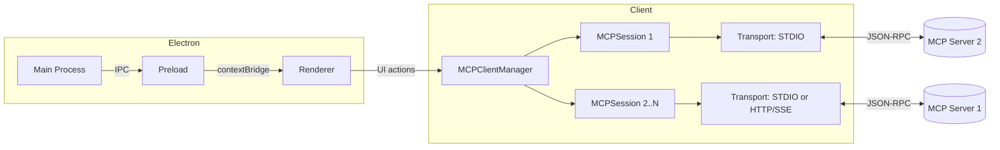
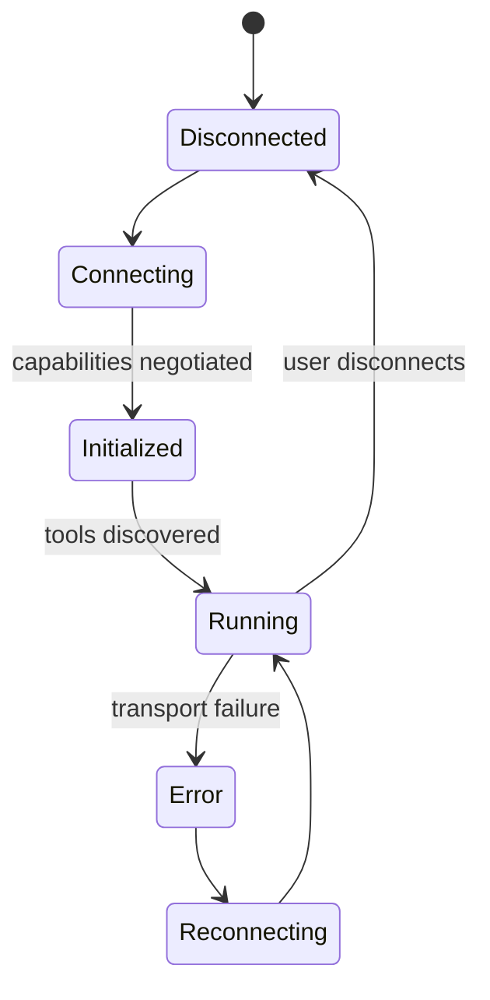
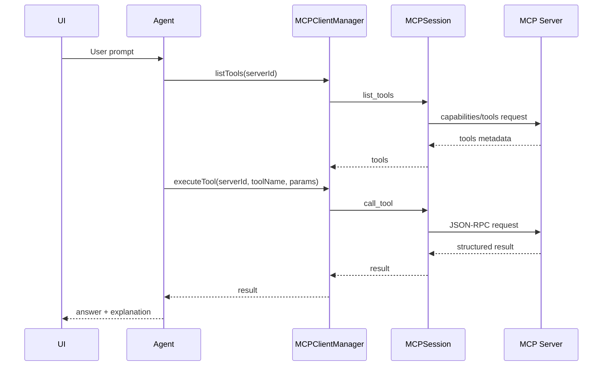

# Study Agent MCP Client (Electron + TypeScript)

An agent-ready, desktop Model Context Protocol (MCP) client for study workflows: summarization, flashcards, quiz generation, and mentoring. Built with Electron Forge (Webpack + TypeScript) and designed to connect to any MCP-compliant server while remaining LLM and framework agnostic.

This README explains the architecture, project structure, how the app works, and three production-capable AI agent implementations you can adopt without code snippets: (1) LangChain-based RAG, (2) NVIDIA NeMo/Agent Toolkit path, and (3) Google Vertex AI Agent Builder path. It also details how MCP fits into the design for tool discovery and execution.

## Project status

Early-stage application scaffold with a working Electron runtime, modular client/transport layers, and UI foundations. The MCP client manager, session wiring, and transport abstractions are in place to support multi-server connections, tool discovery, and tool execution. You will integrate your preferred agent stack (LangChain, NVIDIA, or Google) following the guidance below.

## Key capabilities

- Universal MCP client: discover tools from any MCP server, run tools via a unified API, and orchestrate multiple servers at once
- Agent-ready design: isolate transports, sessions, and tool registry for clean integration with agent frameworks
- Study workflows by composition: PDF summarization, flashcard generation, quiz creation (e.g., via a Google Forms MCP server), and mentoring
- Desktop-first: Electron app with strict isolation between main and renderer via a preload boundary
- Strong typing and modularity: TypeScript-first design with focused separation of concerns

## How the app is organized

Top-level files of interest

- forge.config.ts: Electron Forge configuration
- webpack.*.config.ts: Webpack config for main, renderer, rules, and plugins
- tsconfig.json: TypeScript configuration (strict mode)
- package.json: Scripts and dependencies

Source layout (selected)

- src/
  - index.ts: Electron main entry (BrowserWindow lifecycle, devtools on in development)
  - preload.ts: Safe API surface for renderer via contextBridge (IPC boundary)
  - renderer.ts, index.html, globals.css: Renderer bootstrap and global styles
  - App.tsx: Root render composition for the UI
  - client/
    - index.ts: Client entry for MCP-related exports
    - MCPClientManager.ts: Multi-server orchestration (connect, list tools, execute)
    - MCPSession.ts: A per-server session abstraction (capabilities, tool calls)
    - ConfigManager.ts: Config handling and persistence helpers
    - logger.ts: Centralized logging
    - types.ts: Shared types for client, transports, tools
  - transport/
    - StdioTransport.ts: STDIO transport abstraction for local MCP servers
  - components/
    - layout/ (MainLayout, Sidebar, TopBar, ContentContainer)
    - ui/ (Button, Card, Input, TextArea, LoadingSpinner, Badge, IconButton, MessageBubble, QuickActionCard)
  - views/
    - Chat.tsx: Chat view (agent interaction shell)
    - ServerManager.tsx: Manage MCP server connections and tool discovery
  - lib/
    - utils.ts: Utilities shared across UI and client

## Architecture overview

### System architecture (high-level)



Process model

- Main process (Node.js): window lifecycle, future MCP session orchestration, logging, secured IPC
- Preload script: contextBridge to expose safe, typed APIs to the renderer
- Renderer process (Chromium): UI (chat, tool explorer, server manager), interaction with the preload API

Core layers and responsibilities

- Transport layer: abstracts how MCP messages flow (STDIO for local servers today; HTTP/SSE can be added)
- Session layer: manages one MCP server connection, negotiates capabilities (tools/resources/prompts/logging), lists tools, and executes tool calls
- Manager layer: multiplexes multiple sessions, aggregates tools across servers, and manages lifecycles
- UI layer: user workflows (chat, tool browsing, server lifecycle), results and errors surfaced clearly for learning feedback

Security model

- Context isolation enforced: Node.js APIs are not available in the renderer
- All privileged operations flow via preload and validated IPC calls
- Input validation and schema checking for tool execution is expected at the boundary (e.g., Zod)

### MCPSession lifecycle (states)



## How it works at runtime

- Startup: main creates a BrowserWindow, enables devtools in development, and loads the renderer entry
- Preload: exposes a minimal MCP API to the renderer, such as connecting to a server, listing tools, and executing tools
- Connection model: the manager creates one MCPSession per server; each session negotiates capabilities and supports tool discovery and execution
- UI: the Server Manager view handles connections and discovery; the Chat view is the space for agent interactions, streaming results, and study workflow orchestration

## Model Context Protocol (MCP) in this app

MCP is an open protocol that standardizes how clients and servers exchange tools, resources, prompts, logging, and sampling over JSON-RPC. The protocol is transport-agnostic and supports multiple transports (e.g., STDIO for local process servers and HTTP/SSE for remote servers). The client discovers server capabilities and reacts accordingly.

In practice

- Capabilities: a server may declare tools, prompts, resources, and logging; the client adapts the UI and API surface to what’s present
- Tool discovery: enumerate server tools with names, descriptions, and input schemas for safe calling
- Tool execution: validate inputs against schemas, provide parameters, receive structured results, and surface errors usefully
- Multi-server orchestration: maintain multiple concurrent sessions; ensure each message is routed to the correct session/transport; aggregate tools in a unified registry
- Transports: use STDIO for local processes; extend to HTTP/SSE for remote servers and streaming

What to expect from servers

- Tools: invoke actions (e.g., “create_form”, “summarize_pdf”, “generate_flashcards”)
- Prompts: predefined templates for consistent interactions
- Resources: named, fetchable pieces of context
- Logging: server-side logs delivered to the client for observability

References

- Model Context Protocol specification: capabilities (tools/prompts/resources/logging), streamable HTTP transport (including SSE) and multi-connection handling are covered in the public spec

### MCP tool execution sequence



## Agent implementations you can adopt (no code included)

You can power the app’s agent behaviors with one of three production-ready paths. Each integrates cleanly with the MCP client and UI. Choose based on your infra, ecosystem preference, and deployment constraints.

### Option A — LangChain-based RAG (JavaScript/TypeScript)

Concept

- Use LangChain’s retrieval and agent primitives in TypeScript to implement Retrieval-Augmented Generation (RAG) and tool-using agents
- Combine chunking, embedding, vector search, reranking, and response synthesis
- Add tools for file loading, PDF parsing, web fetches, or domain-specific actions; expose callable tools from MCP servers to the agent

Typical flow

- Ingestion: parse PDFs and notes; chunk with a recursive splitter; generate embeddings; index into a vector store
- Retrieval: create a retriever with a suitable search strategy (e.g., similarity, MMR) and optional reranker for quality
- Augmentation: construct compact, well-structured context windows tailored to questions
- Agent loop: enable tool use for browsing documents or calling MCP tools (e.g., quiz generation). Use typed schemas and guardrails for tool I/O
- Evaluation: measure groundedness, faithfulness, and answer accuracy using offline datasets and spot checks; iterate on chunk size, overlap, retriever parameters, and reranker choice

When to pick this

- You prefer TypeScript end-to-end and want a vibrant OSS ecosystem
- You need full control over your RAG pipeline and vector store
- You plan to integrate multiple MCP servers as tool sources for the agent

What to prepare

- A vector database or embed + local store strategy
- A reranker if you need higher answer quality on longer documents
- API keys for your chosen model provider

### Option B — NVIDIA path: NeMo Agent Toolkit and NIMs

Concept

- Use NVIDIA’s NeMo Agent Toolkit to build and observe tool-using agents with first-class evaluation and profiling support
- Integrate RAG with NVIDIA NIM microservices when you need GPU-accelerated inference or enterprise observability

Typical flow

- Agent wiring: define tools and workflows; integrate with your data sources and business logic
- Observability: enable tracing with supported backends to understand tool decisions, latency, and bottlenecks
- Evaluation: run structured evaluation on datasets (e.g., RAG accuracy, groundedness, relevance, and trajectory accuracy) to benchmark changes
- Scaling: deploy NIM-backed endpoints for model and reranker services, and keep agent logic portable

When to pick this

- You’re standardizing on NVIDIA stacks or need GPU acceleration and enterprise observability
- You want built-in evaluation, profiling, and a structured agent development lifecycle

What to prepare

- Access to NVIDIA services or on-prem GPUs
- Evaluation datasets (question/answer pairs and acceptance criteria)
- Credentials for model endpoints or NIM instances

### Option C — Google path: Vertex AI Agent Builder (Agent Engine, Memory Bank) and RAG API

Concept

- Use Vertex AI Agent Builder to create tool-using agents, manage long-term memory with Memory Bank, and ground answers via RAG API
- Combine tools/actions, memory, and knowledge bases to deliver reliable study assistants

Typical flow

- Tools/actions: define agent-executable actions (e.g., import study material, create quizzes via a Google Forms MCP server)
- Memory Bank: capture durable, scoped “facts” about users/sessions to personalize study guidance
- Knowledge and grounding: connect document stores or enterprise search; use Vertex AI RAG API for retrieval and grounding
- Governance: apply enterprise security, quotas, and monitoring via Google Cloud

When to pick this

- You operate on Google Cloud and want managed agents, grounding, and memory primitives
- You need native integration with Vertex AI models (Gemini) and connectors

What to prepare

- A Google Cloud project with Vertex AI enabled
- Agent definitions, memory scopes, and access to a knowledge source or RAG API
- Credentials and IAM policies configured for your environment

## How MCP, agents, and UI fit together

- Server connections: the app establishes sessions to one or more MCP servers (e.g., a PDF tools server, a Google Forms server, and a web search server)
- Discovery: sessions enumerate tools and capabilities; the UI shows a consolidated tool catalog
- Agent backbone: your chosen agent stack (LangChain, NeMo, or Vertex AI) is responsible for selecting and sequencing tools; the MCP client executes tool calls safely and returns structured results
- Results rendering: responses, partial updates, and tool outputs appear in the Chat view; errors are captured and explained for learning feedback

### Layers and options

```mermaid
flowchart LR
  subgraph UI_Layer[UI Layer]
    Chat[Chat View]
    ServerMgr[Server Manager]
  end

  subgraph Agent_Layer[Agent Layer]
    AgentA[LangChain Agent (Option A)]
    AgentB[NeMo Agent Toolkit (Option B)]
    AgentC[Vertex AI Agent Builder (Option C)]
  end

  subgraph MCP_Layer[MCP Layer]
    Manager2[MCPClientManager]
    Session2[MCPSession x N]
  end

  subgraph Transport[Transport]
    STDIO[STDIO]
    HTTP[HTTP/SSE]
  end

  subgraph Servers[MCP Servers]
    PDF[(PDF Tools)]
    Forms[(Google Forms)]
    Search[(Web Search)]
  end

  Chat --> AgentA
  Chat --> AgentB
  Chat --> AgentC
  ServerMgr --> Manager2
  AgentA --> Manager2
  AgentB --> Manager2
  AgentC --> Manager2
  Manager2 --> Session2
  Session2 --> STDIO
  Session2 --> HTTP
  STDIO --> PDF
  STDIO --> Forms
  STDIO --> Search
  HTTP --> PDF
  HTTP --> Forms
  HTTP --> Search
```

## Typical study workflows (composed via tools)

- Summarize PDFs: ingest one or more PDFs, chunk, embed, and retrieve the most relevant sections; produce concise summaries per goal
- Generate flashcards: transform retrieved content into high-quality Q/A flashcards with difficulty tags and spacing suggestions
- Quiz creation: call a quiz-generation MCP tool (e.g., Google Forms) to produce a shareable quiz link
- Mentor loop: use memory to track learner progress, reinforce weak areas, and adapt difficulty over time

### Study workflow (RAG pipeline)

```mermaid
flowchart TD
  U[User PDFs/Notes] --> I[Ingestion & Chunking]
  I --> E[Embeddings]
  E --> VS[(Vector Store)]
  Q[Question] --> R[Retriever]
  VS --> R
  R --> A[Augmented Prompt]
  A --> LLM[LLM]
  LLM --> Out[Summary / Flashcards / Quiz Items]
  Out -->|MCP Tool| GF[Google Forms (MCP)]
  Out --> UI[Chat + Review]
```

## Configuration and environment

- Configuration management is centralized in client utilities and the MCP manager
- Provide model and provider credentials strictly via environment configuration or OS keychain, not hard-coded into the renderer
- For MCP servers, define connection parameters (e.g., executable path for STDIO or endpoint for HTTP/SSE) and expected capabilities
- Validate all IPC inputs (e.g., Zod schemas) and sanitize any user-provided paths or network targets

## Extending transports and sessions

- Add HTTP/SSE transport for remote MCP servers if you plan to host them behind secure endpoints
- Support multiple concurrent streams responsibly (the MCP spec allows simultaneous connections; ensure messages are not duplicated across streams)
- Apply origin validation and authentication for any HTTP-based transport in untrusted networks

## UI overview

- Chat view: multi-turn interactions, tool results, and explanations; designed to encourage learning, not just answers
- Server Manager: add/remove MCP servers, inspect capabilities, and test tool calls
- Tool Explorer (future): browse, filter, and learn about available tools and their schemas

## Quality, testing, and reliability

- Type safety: TypeScript across main, preload, and renderer; avoid any unsafe escape hatches in renderer
- Error handling: surface tool execution errors clearly; prefer typed result wrappers with clear success/failure states and messages
- Evaluation: for RAG or agent logic, use offline datasets and structured evaluators (e.g., groundedness, relevance, and accuracy) before rolling changes into study sessions
- Observability: enable tracing for tool calls, agent decisions, and latency to drive continuous improvement

## Production considerations

- Security: principle of least privilege; context isolation; strict input validation; avoid enabling Node integration in renderer
- Data governance: treat sensitive PDFs and quiz content according to your organization’s policies; encrypt at rest and in transit if storing locally
- Performance: monitor chunk sizes, embedding throughput, and retriever latencies; add reranking where it improves answer quality
- Upgradability: keep the MCP client decoupled from your agent implementation to switch stacks with minimal effort

## Roadmap

- Add HTTP/SSE transport implementation alongside STDIO
- Implement a Tool Explorer UI with schema-first inspection and sample calls
- Provide optional built-in vector store and reranker integration for a ready-to-run RAG pipeline
- Add first-party connectors for common study sources (cloud drives, LMS systems)
- Ship evaluation harness references for each agent path (LangChain, NVIDIA, Google)

## Glossary

- MCP (Model Context Protocol): a protocol for standardizing client/server interactions around tools, prompts, resources, logging, and sampling via JSON-RPC over pluggable transports
- Tool: a callable operation exposed by an MCP server with a name, description, and input schema
- RAG (Retrieval-Augmented Generation): a pattern that retrieves relevant context from a knowledge base and augments the model’s input to improve factuality and specificity
- Memory: durable user or session facts used by agents to personalize behavior over time (e.g., Google Vertex AI Memory Bank)

## References (overview)

- Model Context Protocol: specification, capabilities, and transports (including HTTP/SSE)
- LangChain (JavaScript/TypeScript): agents, tools, and retrieval patterns for RAG applications
- NVIDIA NeMo/Agent Toolkit: agent development, observability, evaluation, and NIM-backed deployment
- Google Vertex AI Agent Builder: tools/actions, Memory Bank, RAG API, and grounding on Google Cloud
