# 🧠 AI Study Agent - Intelligent Learning Assistant

[](https://www.typescriptlang.org/)
[](https://www.electronjs.org/)
[](https://www.python.org/)
[](https://langchain.com/)
[](LICENSE)

> **An advanced AI-powered study assistant leveraging Retrieval-Augmented Generation (RAG), Agentic AI, and the Model Context Protocol (MCP) to deliver personalized, context-aware learning experiences.**

---

## 📋 Table of Contents

- [Phase 1: Foundational Concepts & Architecture](#phase-1-foundational-concepts--architecture)
  - [What is RAG?](#what-is-rag-retrieval-augmented-generation)
  - [What is Agentic AI?](#what-is-agentic-ai)
  - [What is MCP?](#what-is-mcp-model-context-protocol)
  - [NVIDIA NIM Architecture](#nvidia-nim-architecture--api)
  - [System Architecture Overview](#system-architecture-overview)
  - [Technology Stack](#technology-stack)
- [Phase 2: Implementation Details](#phase-2-implementation-details) _(Coming Next)_
- [Phase 3: Deployment & Usage](#phase-3-deployment--usage) _(Coming Last)_

---

## Phase 1: Foundational Concepts & Architecture

### 🎯 Project Vision

The **AI Study Agent** is a next-generation desktop application that transforms how students interact with their study materials. By combining cutting-edge AI technologies—Retrieval-Augmented Generation (RAG), Agentic AI workflows, and the Model Context Protocol (MCP)—this application provides intelligent, context-aware assistance for summarization, quiz generation, flashcard creation, and personalized study mentoring.

**Key Innovation:** Unlike traditional chatbots that rely solely on pre-trained knowledge, this system grounds its responses in your actual study materials, ensuring accurate, relevant, and up-to-date information.

---

### 📚 What is RAG (Retrieval-Augmented Generation)?

#### Core Concept

**Retrieval-Augmented Generation (RAG)** is an advanced AI technique that enhances Large Language Models (LLMs) by providing them with relevant external knowledge during the generation process. Instead of relying solely on the model's training data (which has a knowledge cutoff), RAG systems fetch pertinent information from external sources in real-time.

#### How RAG Works

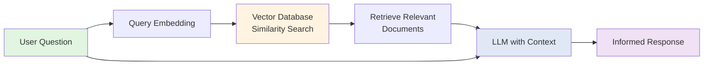

**The RAG Pipeline:**

1. **Document Ingestion**: Your study materials (PDFs, text files, etc.) are loaded and split into manageable chunks
2. **Embedding Creation**: Each chunk is converted into a numerical vector (embedding) that captures its semantic meaning
3. **Vector Storage**: Embeddings are stored in a vector database (ChromaDB in our case)
4. **Query Processing**: When you ask a question, it's also converted into an embedding
5. **Similarity Search**: The system finds the most relevant document chunks using vector similarity
6. **Context Augmentation**: Retrieved chunks are provided as context to the LLM
7. **Response Generation**: The LLM generates an answer grounded in your actual study materials

#### RAG in This Project

Our implementation uses:

- **NVIDIA NVEmbeddings** (`llama-3.2-nemoretriever-300m-embed-v2`) for high-quality semantic embeddings
- **ChromaDB** for persistent vector storage with efficient similarity search
- **Optimized Chunking**: Token-based semantic chunking (512 tokens with 128 token overlap) for better context preservation
- **Top-K Retrieval**: Configurable number of most relevant chunks (default: 5)

**Why Token-Based Chunking?**

```python
# Traditional character-based chunking
CHUNK_SIZE = 2000  # characters - inconsistent token counts

# Our token-based approach
CHUNK_SIZE = 512  # tokens - consistent LLM processing
CHUNK_OVERLAP = 128  # 25% overlap preserves context across boundaries
```

This ensures that each chunk contains roughly the same amount of information, regardless of the document's language or formatting, leading to more consistent retrieval results.

---

### 🤖 What is Agentic AI?

#### Core Concept

**Agentic AI** refers to AI systems that can reason, plan, and autonomously execute multi-step tasks to achieve goals. Unlike simple chatbots that respond to single queries, agentic systems break down complex problems, use tools, and iteratively work toward solutions.

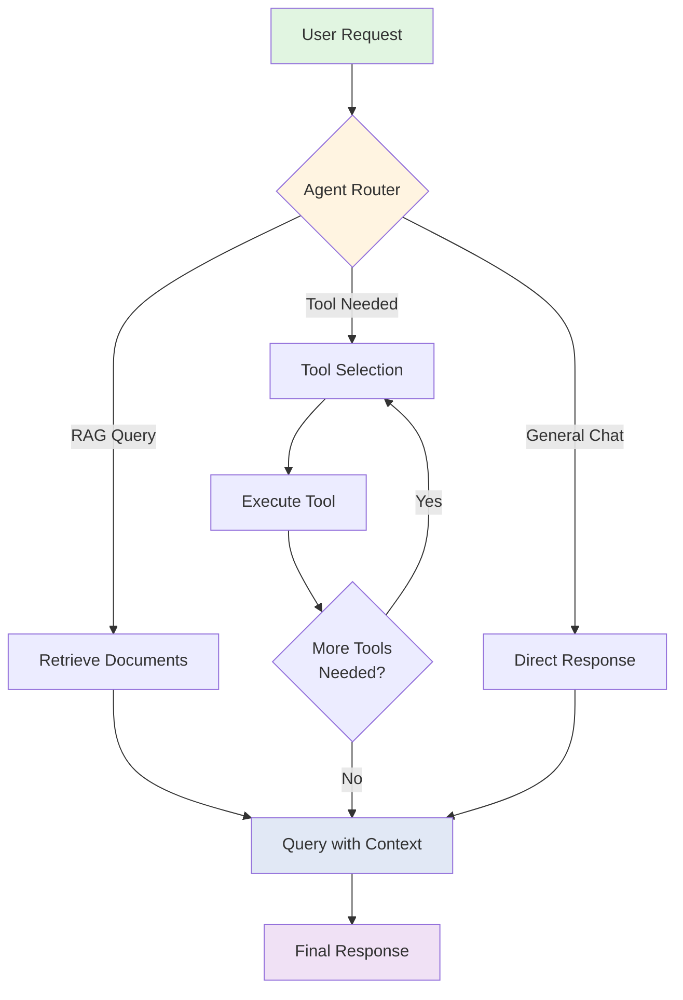

#### Key Characteristics

1. **Autonomous Reasoning**: Determines the best approach to solve problems
2. **Tool Usage**: Can invoke external tools (APIs, databases, calculators, etc.)
3. **Multi-Step Planning**: Breaks complex tasks into manageable steps
4. **Iterative Refinement**: Learns from intermediate results and adjusts strategy
5. **Goal-Oriented**: Focuses on achieving user objectives, not just answering questions

#### Agentic AI in This Project

Our Study Agent implements a **state graph workflow** using LangGraph:

```typescript
// Agent State Graph Architecture
StateGraph → Router Node → {
  "RAG Path": Retrieve Documents → Query LLM
  "Tool Path": Select Tool → Execute → Query LLM
  "General Path": Direct Query LLM
}
```

**State Management:**

```typescript
interface StudyAgentState {
  messages: BaseMessage[]; // Conversation history
  route: "rag" | "tool" | "general"; // Routing decision
  context?: string; // Retrieved document context
  toolCalls?: ToolCall[]; // Tool execution records
}
```

**The agent can:**

- 📄 Analyze your uploaded study materials via RAG
- 🔧 Use MCP tools for specialized tasks (flashcard generation, quiz creation)
- 💬 Engage in general study mentoring conversations
- 🔄 Switch between modes dynamically based on your needs

---

### 🔌 What is MCP (Model Context Protocol)?

#### Core Concept

The **Model Context Protocol (MCP)** is an open standard that enables AI applications to securely connect to external data sources and tools. Think of it as USB-C for AI—a universal connector that allows LLMs to interact with any service implementing the protocol.

#### MCP Architecture

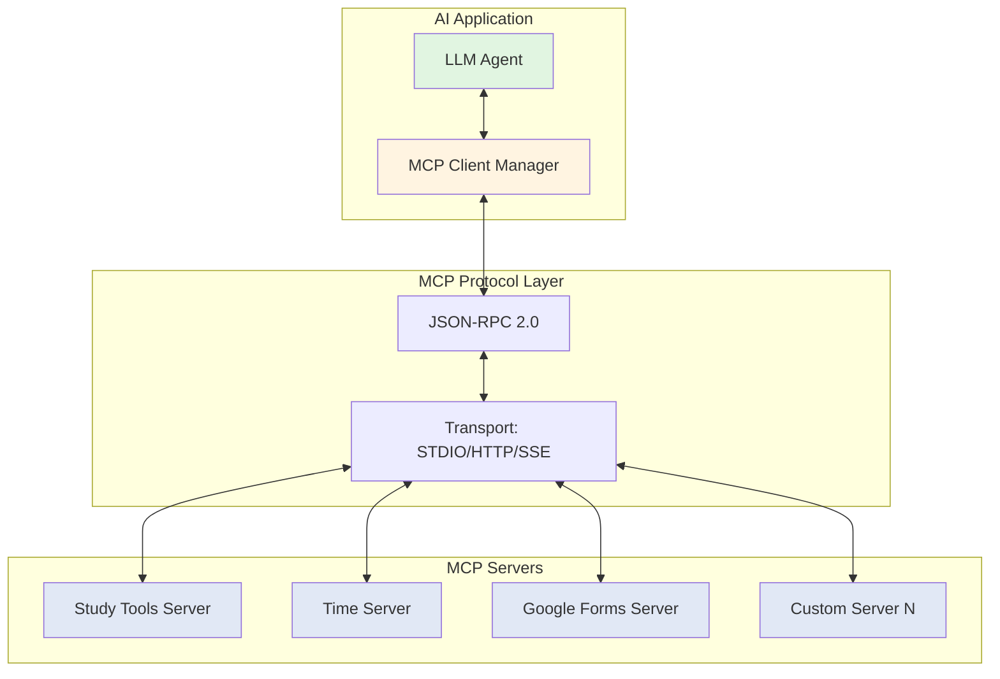

#### Key Features

1. **Dynamic Tool Discovery**: Servers advertise their capabilities; clients discover them at runtime
2. **Standardized Communication**: JSON-RPC 2.0 ensures consistent message format
3. **Multiple Transports**: Supports STDIO (local processes), HTTP, and Server-Sent Events (SSE)
4. **Security**: Sandboxed execution with explicit permission controls
5. **Extensibility**: Add new capabilities by adding new servers—no code changes needed

#### MCP in This Project

**Client-Side Implementation:**

```typescript
class MCPClientManager {
  private sessions = new Map<string, MCPSession>();

  async addServer(config: MCPServerConfig): Promise<void> {
    const session = new MCPSession(config);
    await session.connect();
    this.sessions.set(config.id, session);
    this.notifyToolChange(); // Agent reloads available tools
  }

  getAllTools(): Tool[] {
    return Array.from(this.sessions.values()).flatMap(
      (session) => session.tools
    );
  }
}
```

**Server Configuration (`mcp.json`):**

```json
{
  "servers": {
    "mcp-time": {
      "type": "stdio",
      "command": "npx",
      "args": ["@theo.foobar/mcp-time@0.4.0"],
      "env": {}
    }
  }
}
```

**Benefits:**

- 🔄 **Hot-Reload**: Add/remove servers without restarting the application
- 🛠️ **Modular Design**: Each server is independent and maintainable
- 🌐 **Ecosystem**: Leverage the growing MCP server ecosystem
- 🔒 **Secure**: User approval for sensitive tool executions

---

### 🚀 NVIDIA NIM Architecture & API

#### What is NVIDIA NIM?

**NVIDIA NIM (NVIDIA Inference Microservices)** provides optimized, production-ready APIs for deploying AI models at scale. It offers:

1. **High-Performance Inference**: GPU-accelerated model serving
2. **OpenAI-Compatible APIs**: Drop-in replacement for OpenAI SDK
3. **Enterprise Features**: Rate limiting, monitoring, and scalability

#### Models Used in This Project

##### 1. Embedding Model

```python
EMBEDDING_MODEL = "nvidia/llama-3.2-nemoretriever-300m-embed-v2"
```

**Specifications:**

- **Type**: Dense retrieval embedding model
- **Dimensions**: 300 million parameters
- **Purpose**: Converting text to semantic vectors
- **Use Case**: Document and query embedding for RAG

**Why This Model?**

- Optimized for retrieval tasks
- Excellent semantic understanding
- Efficient inference on NVIDIA infrastructure
- Superior performance on academic/technical content

##### 2. Language Model

```python
LLM_MODEL = "moonshotai/kimi-k2-instruct"
```

**Specifications:**

- **Type**: Instruction-tuned chat model
- **Purpose**: Text generation and reasoning
- **Use Case**: Generating responses, summaries, and explanations

**API Rate Limits:**

- **Free Tier**: 40 requests per minute
- **Response Time**: ~1-3 seconds per query
- **Max Tokens**: Configurable (default: 4096)

#### API Integration

**Authentication:**

```python
# Environment variable
NVIDIA_API_KEY = os.getenv("NVIDIA_API_KEY")

# Initialize clients
embeddings = NVIDIAEmbeddings(model=EMBEDDING_MODEL)
llm = ChatNVIDIA(model=LLM_MODEL, max_tokens=4096, temperature=0.7)
```

**Request Flow:**

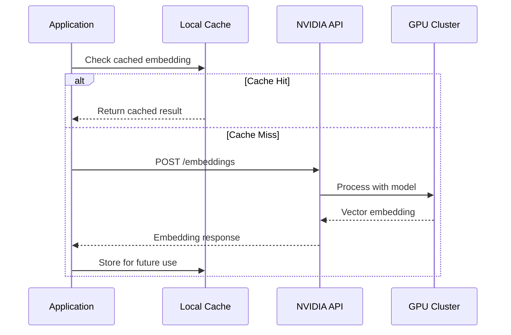

**Error Handling:**

```python
try:
    response = await llm.ainvoke(messages)
except RateLimitError:
    # Handle rate limiting (40 req/min)
    await asyncio.sleep(1.5)
    response = await llm.ainvoke(messages)
except APIError as e:
    # Handle API errors gracefully
    logger.error(f"NVIDIA API error: {e}")
```

#### Cost & Performance Optimization

**Strategies Implemented:**

1. **Batch Processing**: Group multiple documents for embedding
2. **Caching**: Store embeddings in ChromaDB for reuse
3. **Rate Limiting**: Built-in throttling to stay within free tier limits
4. **Lazy Loading**: Load models only when needed

---

### 🏗️ System Architecture Overview

#### High-Level Architecture

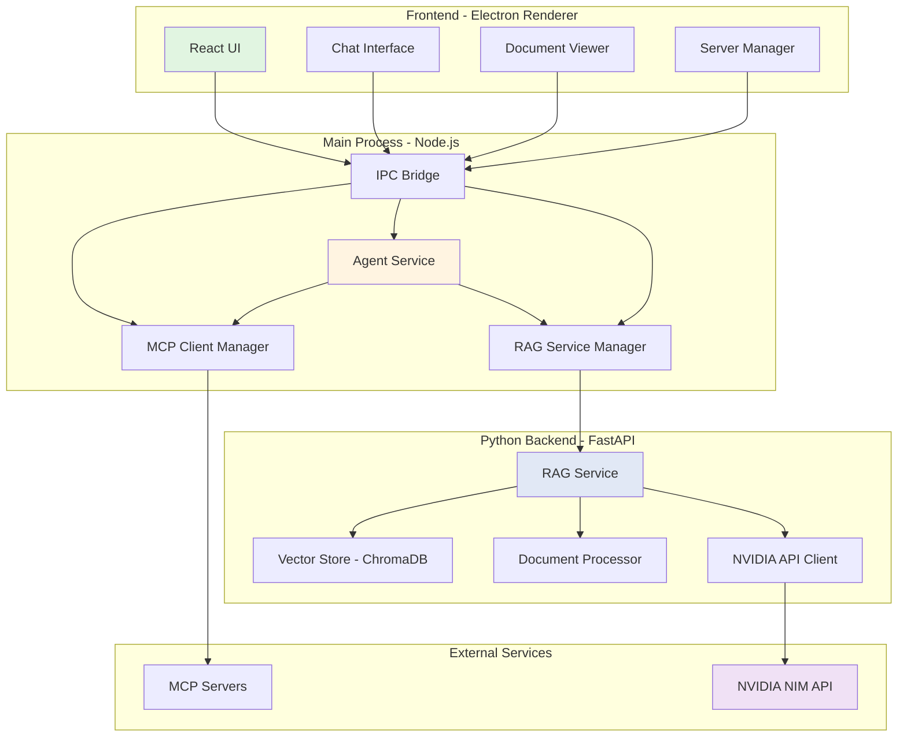

#### Process Model

**Electron Multi-Process Architecture:**

```
┌─────────────────────────────────────────┐
│  Main Process (Node.js)                 │
│  src/index.ts                           │
│  - Window lifecycle                     │
│  - MCP client manager                   │
│  - RAG service orchestration            │
│  - IPC handlers                         │
└────────────┬────────────────────────────┘
             │ IPC Communication
┌────────────▼────────────────────────────┐
│  Renderer Process (Chromium)            │
│  src/renderer.ts, src/App.tsx           │
│  - React UI rendering                   │
│  - Chat interface                       │
│  - Document preview                     │
│  - User interactions                    │
└────────────┬────────────────────────────┘
             │ contextBridge (Security)
┌────────────▼────────────────────────────┐
│  Preload Script                         │
│  src/preload.ts                         │
│  - Expose safe APIs to renderer         │
│  - IPC message sanitization             │
└─────────────────────────────────────────┘
```

**Python RAG Service (Subprocess):**

```
┌─────────────────────────────────────────┐
│  FastAPI Server (Python)                │
│  python/nvidia_rag_service.py           │
│  - REST API endpoints                   │
│  - Document ingestion                   │
│  - Vector search                        │
│  - RAG query processing                 │
└────────────┬────────────────────────────┘
             │ HTTP (localhost:8000)
┌────────────▼────────────────────────────┐
│  ChromaDB Vector Store                  │
│  chroma_db/                             │
│  - Persistent embeddings                │
│  - Similarity search indices            │
│  - Collection management                │
└─────────────────────────────────────────┘
```

#### Component Interaction Flow

**Document Upload Workflow:**

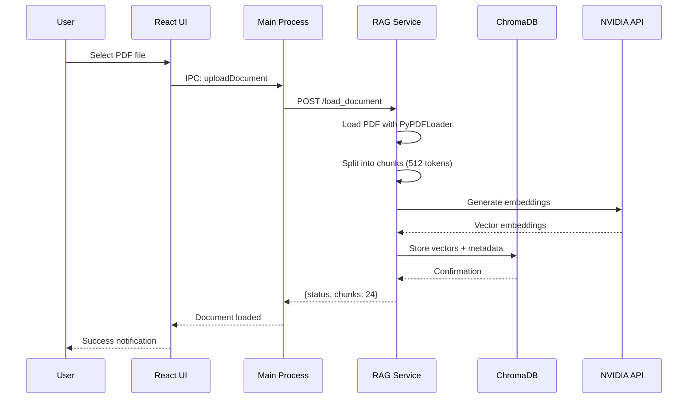

**Chat Query Workflow:**

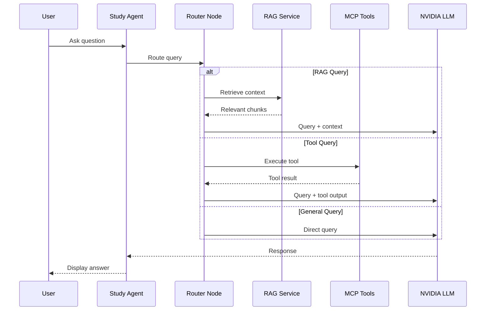

#### Data Flow Architecture

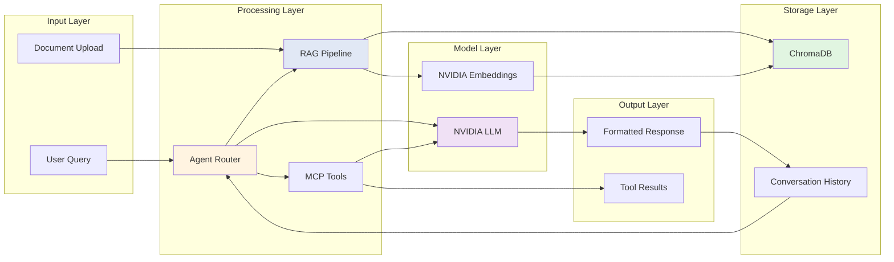

---

### 🛠️ Technology Stack

#### Frontend Layer

| Technology        | Version | Purpose                          |
| ----------------- | ------- | -------------------------------- |
| **Electron**      | 38.2.0  | Cross-platform desktop framework |
| **React**         | 19.2.0  | UI component library             |
| **TypeScript**    | 5.6.3   | Type-safe JavaScript             |
| **Tailwind CSS**  | 4.1.x   | Utility-first styling            |
| **Framer Motion** | 12.23.x | Animation library                |
| **Lucide React**  | 0.544.0 | Icon library                     |

#### Backend Layer (Node.js)

| Technology                    | Version | Purpose                     |
| ----------------------------- | ------- | --------------------------- |
| **LangChain**                 | 0.3.7   | LLM orchestration framework |
| **LangGraph**                 | 0.4.9   | State graph workflow engine |
| **@langchain/mcp-adapters**   | 0.6.0   | MCP integration             |
| **@modelcontextprotocol/sdk** | 1.22.0  | MCP client SDK              |
| **dotenv**                    | 16.4.5  | Environment configuration   |

#### Backend Layer (Python)

| Technology                        | Version | Purpose                  |
| --------------------------------- | ------- | ------------------------ |
| **FastAPI**                       | 0.104+  | Modern web framework     |
| **LangChain**                     | 0.1.0+  | LLM framework            |
| **langchain-nvidia-ai-endpoints** | 0.3.0+  | NVIDIA model integration |
| **ChromaDB**                      | 0.5.0+  | Vector database          |
| **PyPDF**                         | 3.17.0+ | PDF document processing  |
| **Uvicorn**                       | 0.24.0+ | ASGI server              |
| **tiktoken**                      | latest  | Token counting           |

#### Build & Development Tools

| Tool               | Purpose                            |
| ------------------ | ---------------------------------- |
| **Electron Forge** | Build and package Electron apps    |
| **Webpack**        | Module bundler                     |
| **ts-loader**      | TypeScript compilation for Webpack |
| **ESLint**         | Code linting                       |
| **tsx**            | TypeScript execution for testing   |

#### AI Models & Services

| Service               | Model/API                             | Purpose              |
| --------------------- | ------------------------------------- | -------------------- |
| **NVIDIA NIM**        | llama-3.2-nemoretriever-300m-embed-v2 | Document embeddings  |
| **NVIDIA NIM**        | moonshotai/kimi-k2-instruct           | Text generation      |
| **OpenAI-compatible** | Custom endpoints                      | Fallback LLM support |

#### Key Design Patterns

1. **Microservices Architecture**: Separation of concerns between Electron, Python RAG service, and MCP servers
2. **Event-Driven Communication**: IPC for frontend-backend, HTTP for RAG service
3. **Repository Pattern**: Abstracted data access through service layers
4. **State Management**: LangGraph for agent state, Zustand for UI state
5. **Dependency Injection**: Configurable services and models

---

### 📊 UML Diagrams

#### Class Diagram - Core Components

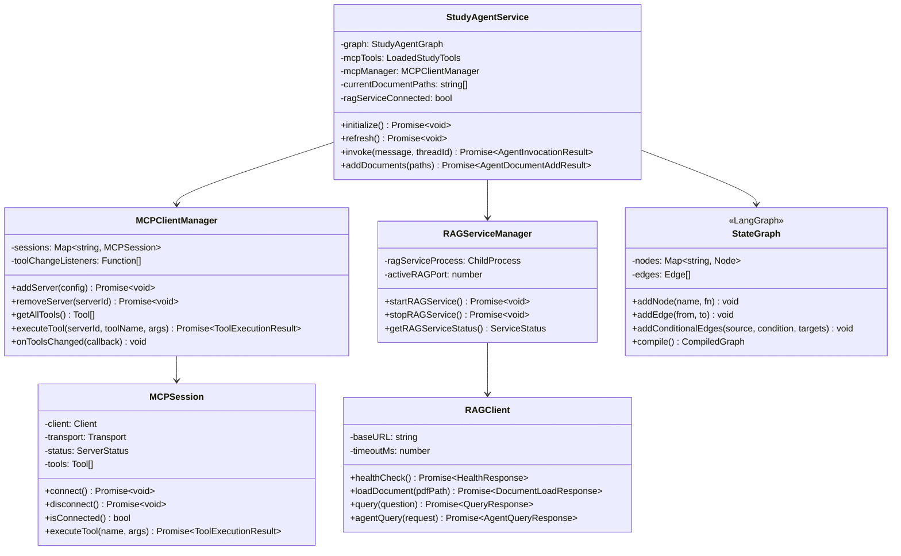

#### Sequence Diagram - Agent Invocation

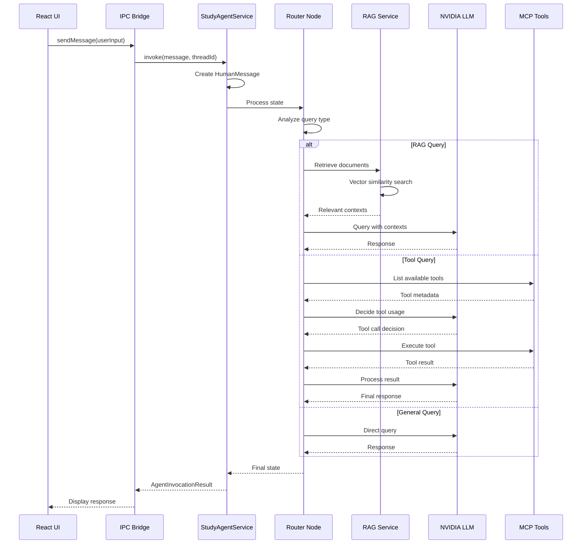

#### Activity Diagram - Document Upload & Processing

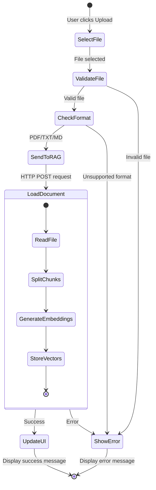

#### State Machine Diagram - Agent Workflow

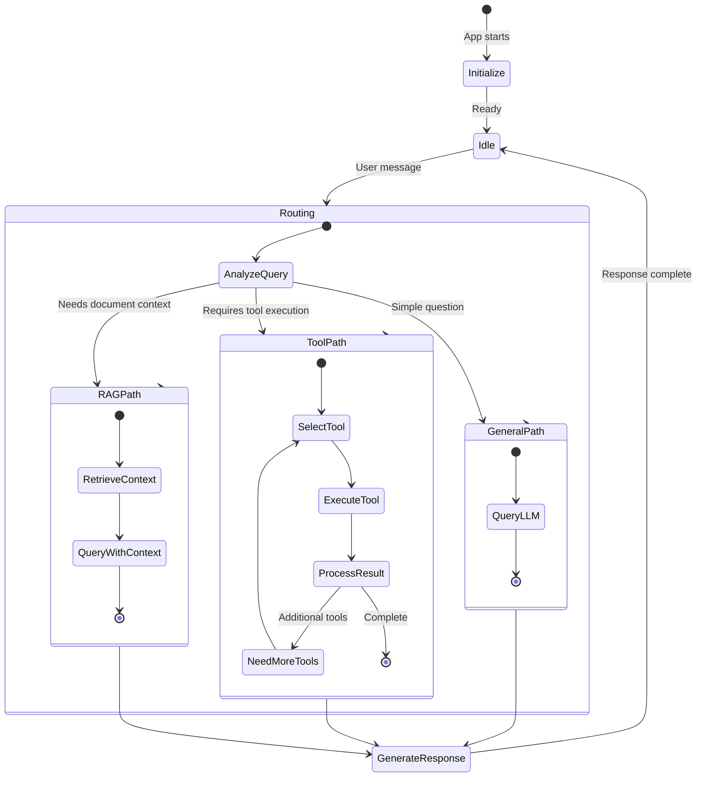

---

### 🔒 Security Considerations

#### Authentication & Authorization

```typescript
// User authentication with JWT-like tokens
interface User {
  id: string;
  username: string;
  token: string;
}

// Secure storage in Electron
import { safeStorage } from "electron";
const encrypted = safeStorage.encryptString(apiKey);
```

#### Context Isolation

```typescript
// preload.ts - Secure IPC bridge
contextBridge.exposeInMainWorld("electronAPI", {
  sendMessage: (message: string) => ipcRenderer.invoke("send-message", message),
  onMessageReceived: (callback) => ipcRenderer.on("message-received", callback),
});
```

#### API Key Management

- 🔐 Environment variables for sensitive data
- 🚫 Never expose keys in frontend code
- 🔄 Rotate keys regularly
- 📝 Keys stored in `.env` (gitignored)

---

## 🎯 Key Benefits

| Feature                  | Benefit                                                  |
| ------------------------ | -------------------------------------------------------- |
| **RAG-Powered Accuracy** | Responses grounded in your actual study materials        |
| **Agentic Intelligence** | Multi-step problem solving and autonomous task execution |
| **MCP Extensibility**    | Add new capabilities by connecting new servers           |
| **NVIDIA Performance**   | Fast, GPU-accelerated inference                          |
| **Offline-First**        | Local vector database, minimal API calls                 |
| **Privacy-Focused**      | Documents processed locally, not sent to third parties   |

---

## 📈 Performance Metrics

| Metric                   | Value                              |
| ------------------------ | ---------------------------------- |
| **Document Ingestion**   | ~500-1000 pages/minute             |
| **Query Latency**        | 1-3 seconds (with RAG)             |
| **Embedding Generation** | ~50ms per chunk                    |
| **Vector Search**        | <100ms for top-5 results           |
| **Memory Usage**         | ~200-500MB (Electron + Python)     |
| **Storage**              | ~5-10MB per 100 pages (embeddings) |

---

---

## Phase 2: Implementation Details

### 📁 Project Structure

```
ai-study-agent/
├── src/                          # TypeScript/Electron source code
│   ├── index.ts                  # Main process entry point
│   ├── renderer.ts               # Renderer process entry
│   ├── preload.ts                # Security bridge (contextBridge)
│   ├── App.tsx                   # Main React application
│   │
│   ├── agent/                    # Agentic AI implementation
│   │   ├── StudyAgentService.ts  # Main agent orchestrator
│   │   ├── graph.ts              # LangGraph state graph definition
│   │   ├── nodes.ts              # Graph node implementations
│   │   ├── state.ts              # Agent state interface
│   │   └── types.ts              # Type definitions
│   │
│   ├── client/                   # MCP client management
│   │   ├── MCPClientManager.ts   # Multi-server MCP manager
│   │   ├── MCPSession.ts         # Single server session
│   │   ├── MCPToolService.ts     # Tool execution service
│   │   ├── ConfigManager.ts      # Configuration handling
│   │   ├── DatabaseManager.ts    # Local data persistence
│   │   ├── store.ts              # React state management (Zustand)
│   │   ├── logger.ts             # Winston logging
│   │   └── types.ts              # Type definitions
│   │
│   ├── rag/                      # RAG integration
│   │   ├── rag-client.ts         # HTTP client for Python service
│   │   ├── rag-service-manager.ts # Python subprocess management
│   │   └── rag-mcp-integration.ts # MCP bridge for RAG
│   │
│   ├── tools/                    # Tool utilities
│   │   ├── mcp-loader.ts         # Load and patch MCP tools
│   │   ├── tool-parser.ts        # Parse tool call responses
│   │   ├── tool-schema-enricher.ts # Schema validation
│   │   └── integrated-tool-service.ts # Unified tool interface
│   │
│   ├── transport/                # MCP transport layers
│   │   └── StdioTransport.ts     # STDIO communication
│   │
│   ├── models/                   # AI model clients
│   │   └── nvidia-openai-chat.ts # NVIDIA API wrapper
│   │
│   ├── components/               # React UI components
│   │   ├── layout/               # Layout components
│   │   │   ├── MainLayout.tsx
│   │   │   ├── Sidebar.tsx
│   │   │   ├── TopBar.tsx
│   │   │   └── ContentContainer.tsx
│   │   │
│   │   └── ui/                   # Reusable UI components
│   │       ├── Button.tsx
│   │       ├── Input.tsx
│   │       ├── TextArea.tsx
│   │       ├── Badge.tsx
│   │       ├── Card.tsx
│   │       ├── MessageBubble.tsx
│   │       ├── MarkdownRenderer.tsx
│   │       ├── DocumentViewer.tsx
│   │       ├── ToolCallApproval.tsx
│   │       └── LoadingSpinner.tsx
│   │
│   └── views/                    # Main application views
│       ├── Chat.tsx              # Chat interface
│       ├── ChatSidebar.tsx       # Conversation history
│       ├── ServerManager.tsx     # MCP server management
│       ├── AgentConsole.tsx      # Agent status/config
│       ├── Login.tsx             # Authentication
│       └── Signup.tsx            # User registration
│
├── python/                       # Python RAG backend
│   ├── nvidia_rag_service.py     # FastAPI RAG service
│   ├── requirements.txt          # Python dependencies
│   ├── setup.py                  # Package setup
│   └── README.md                 # Python service docs
│
├── tests/                        # Test suites
│   ├── test-agent-e2e.ts         # End-to-end agent tests
│   ├── test-rag-pipeline.ts      # RAG pipeline tests
│   ├── test-document-upload.ts   # Document upload tests
│   └── test-mcp-*.ts             # MCP integration tests
│
├── docs/                         # Documentation
│   ├── TOOL-ENRICHMENT-QUICKSTART.md
│   ├── MARKDOWN-RENDERER-README.md
│   └── *.md                      # Various guides
│
├── .vscode/                      # VS Code configuration
│   └── mcp.json                  # MCP server configuration
│
├── chroma_db/                    # Vector database storage
│   └── chroma.sqlite3            # SQLite persistence
│
├── webpack.*.config.ts           # Webpack configurations
├── forge.config.ts               # Electron Forge config
├── tsconfig.json                 # TypeScript config
├── package.json                  # Node.js dependencies
└── .env                          # Environment variables (gitignored)
```

---

### 🔧 Core Component Implementation

#### 1. Study Agent Service (`src/agent/StudyAgentService.ts`)

The **StudyAgentService** is the heart of the application, orchestrating all AI interactions.

**Key Responsibilities:**

- Initialize and manage the LangGraph state machine
- Coordinate between RAG service and MCP tools
- Handle document uploads and processing
- Manage conversation threads with persistent state

**Implementation Details:**

```typescript
export class StudyAgentService {
  private graph?: StudyAgentGraph;
  private mcpTools?: LoadedStudyTools;
  private initPromise?: Promise<void>;
  private currentDocumentPaths: string[] = [];
  private ragServiceConnected = false;

  constructor(
    options: StudyAgentOptions = {},
    private mcpManager?: MCPClientManager
  ) {
    this.options = { ...options };

    // Listen for tool changes (hot-reload)
    if (this.mcpManager) {
      this.mcpManager.onToolsChanged(() => {
        logger.info("Tools changed, refreshing agent graph...");
        this.refresh().catch((error) => {
          logger.warn("Failed to refresh agent graph:", error);
        });
      });
    }
  }

  async initialize(): Promise<void> {
    if (this.initPromise) {
      return this.initPromise;
    }

    this.initPromise = this.setup().catch((error) => {
      this.initPromise = undefined;
      logger.error("StudyAgentService initialization failed:", error);
      this.lastInitError =
        error instanceof Error ? error.message : String(error);
    });
    return this.initPromise;
  }

  private async setup(): Promise<void> {
    // 1. Check RAG service health
    try {
      const health = await ragClient.healthCheck();
      this.ragServiceConnected = health.status === "healthy";
      logger.info("RAG service connected:", this.ragServiceConnected);
    } catch (error) {
      logger.warn("RAG service not available:", error);
      this.ragServiceConnected = false;
    }

    // 2. Load MCP tools
    try {
      this.mcpTools = await loadStudyMCPTools();
      logger.info(`Loaded ${this.mcpTools.tools.length} MCP tools`);
    } catch (error) {
      logger.warn("Failed to load MCP tools:", error);
      this.mcpTools = {
        tools: [],
        client: null as any,
        transport: null as any,
      };
    }

    // 3. Create LangGraph workflow
    this.graph = await createStudyMentorGraph(this.mcpTools.tools);
    logger.info("Study agent graph created successfully");
  }

  async invoke(
    message: string,
    threadId: string = "default"
  ): Promise<AgentInvocationResult> {
    await this.initialize();

    if (!this.graph) {
      throw new Error("Agent graph not initialized");
    }

    const startTime = performance.now();

    try {
      // Create message with metadata
      const humanMessage = new HumanMessage({
        content: message,
        id: `msg-${Date.now()}`,
      });

      // Invoke graph with state persistence
      const config: RunnableConfig = {
        configurable: { thread_id: threadId },
      };

      const result = await this.graph.invoke(
        { messages: [humanMessage] },
        config
      );

      const lastMessage = result.messages[result.messages.length - 1];

      this.lastInvocationLatencyMs = performance.now() - startTime;

      return {
        success: true,
        response: lastMessage.content as string,
        messages: result.messages,
        metadata: {
          threadId,
          latencyMs: this.lastInvocationLatencyMs,
          route: result.route,
        },
      };
    } catch (error) {
      logger.error("Agent invocation failed:", error);
      return {
        success: false,
        error: error instanceof Error ? error.message : String(error),
        messages: [],
      };
    }
  }

  async addDocuments(paths: string[]): Promise<AgentDocumentAddResult> {
    if (!this.ragServiceConnected) {
      return {
        success: false,
        error: "RAG service not available",
      };
    }

    const results = [];
    for (const path of paths) {
      try {
        const result = await ragClient.loadDocument({ pdf_path: path });
        results.push({
          path,
          success: true,
          chunks: result.chunks,
        });
        this.currentDocumentPaths.push(path);
        this.loadedDocumentCount += result.chunks;
      } catch (error) {
        results.push({
          path,
          success: false,
          error: error instanceof Error ? error.message : String(error),
        });
      }
    }

    return {
      success: results.every((r) => r.success),
      results,
      totalDocuments: this.currentDocumentPaths.length,
      totalChunks: this.loadedDocumentCount,
    };
  }
}
```

**Key Design Patterns:**

1. **Lazy Initialization**: Agent is initialized only when first needed
2. **Error Resilience**: Graceful degradation if RAG or MCP unavailable
3. **Hot Reload**: Automatically refreshes when MCP tools change
4. **Performance Tracking**: Monitors initialization and invocation latency

---

#### 2. LangGraph State Machine (`src/agent/graph.ts`)

The **state graph** defines the agent's decision-making workflow using LangGraph.

**Graph Structure:**

```typescript
export async function createStudyMentorGraph(
  tools: ConstructorParameters<typeof ToolNode>[0]
): Promise<
  CompiledStateGraph<StudyAgentStateType, Partial<StudyAgentStateType>>
> {
  const toolNode = new ToolNode(tools);
  const queryNode = createQueryNode(tools as any[]);

  const workflow = new StateGraph(StudyAgentState)
    .addNode("router", routeNode) // Decides which path to take
    .addNode("query", queryNode) // LLM query with optional tools
    .addNode("retrieve", retrieveNode) // RAG document retrieval
    .addNode("tools", toolNode); // Tool execution

  // Start with routing
  workflow.addEdge(START, "router");

  // Router conditional edges
  workflow.addConditionalEdges("router", (state) => state.route, {
    rag: "retrieve", // Needs document context
    tool: "query", // Needs tool execution
    general: "query", // Direct LLM query
  });

  // After retrieval, always query LLM
  workflow.addEdge("retrieve", "query");

  // After query, check if tools need execution
  workflow.addConditionalEdges(
    "query",
    (state) => {
      const lastMsg = state.messages[state.messages.length - 1];
      const hasToolCalls =
        typeof lastMsg === "object" &&
        lastMsg !== null &&
        "tool_calls" in lastMsg &&
        Array.isArray((lastMsg as { tool_calls?: unknown }).tool_calls) &&
        ((lastMsg as { tool_calls?: unknown[] }).tool_calls?.length ?? 0) > 0;

      return hasToolCalls ? "tools" : END;
    },
    {
      tools: "tools",
      [END]: END,
    }
  );

  // After tools, go back to query for final response
  workflow.addEdge("tools", "query");

  // Compile with memory checkpointer
  const checkpointer = new MemorySaver();
  return workflow.compile({ checkpointer }) as CompiledStateGraph<
    StudyAgentStateType,
    Partial<StudyAgentStateType>
  >;
}
```

**Agent State Definition (`src/agent/state.ts`):**

```typescript
import { Annotation } from "@langchain/langgraph";
import type { BaseMessage } from "@langchain/core/messages";

export const StudyAgentState = Annotation.Root({
  messages: Annotation<BaseMessage[]>({
    reducer: (x, y) => x.concat(y), // Accumulate messages
    default: () => [],
  }),

  route: Annotation<"rag" | "tool" | "general">({
    reducer: (x, y) => y ?? x, // Latest route wins
    default: () => "general" as const,
  }),

  context: Annotation<string>({
    reducer: (x, y) => y ?? x, // Latest context wins
    default: () => "",
  }),
});

export type StudyAgentStateType = typeof StudyAgentState.State;
```

**Node Implementations (`src/agent/nodes.ts`):**

```typescript
import { ChatOpenAI } from "@langchain/openai";
import { ragClient } from "../rag/rag-client";

// Initialize NVIDIA LLM (OpenAI-compatible)
const llm = new ChatOpenAI({
  modelName: process.env.NVIDIA_MODEL_NAME || "moonshotai/kimi-k2-instruct",
  openAIApiKey: process.env.NVIDIA_API_KEY,
  configuration: {
    baseURL: "https://integrate.api.nvidia.com/v1",
  },
  temperature: 0.7,
  maxTokens: 4096,
});

// Router Node: Decides which path to take
export async function routeNode(
  state: StudyAgentStateType
): Promise<Partial<StudyAgentStateType>> {
  const lastMessage = state.messages[state.messages.length - 1];
  const userMessage = lastMessage.content as string;

  // Simple heuristic routing (can be enhanced with LLM-based classification)
  const needsContext =
    userMessage.toLowerCase().includes("document") ||
    userMessage.toLowerCase().includes("pdf") ||
    userMessage.toLowerCase().includes("study material") ||
    userMessage.toLowerCase().includes("explain from");

  const needsTool =
    userMessage.toLowerCase().includes("flashcard") ||
    userMessage.toLowerCase().includes("quiz") ||
    userMessage.toLowerCase().includes("summary") ||
    userMessage.toLowerCase().includes("create");

  let route: "rag" | "tool" | "general" = "general";

  if (needsContext) {
    route = "rag";
  } else if (needsTool) {
    route = "tool";
  }

  logger.info(`Router selected path: ${route}`);
  return { route };
}

// Retrieve Node: Fetches relevant documents from RAG
export async function retrieveNode(
  state: StudyAgentStateType
): Promise<Partial<StudyAgentStateType>> {
  const lastMessage = state.messages[state.messages.length - 1];
  const query = lastMessage.content as string;

  try {
    const result = await ragClient.query({
      question: query,
      top_k: 5,
    });

    // Format context from retrieved documents
    const context = result.sources
      .map((source, idx) => `[${idx + 1}] ${source.content}`)
      .join("\n\n");

    logger.info(`Retrieved ${result.sources.length} relevant chunks`);
    return { context };
  } catch (error) {
    logger.error("Failed to retrieve documents:", error);
    return { context: "" };
  }
}

// Query Node: Invokes LLM with optional context and tools
export function createQueryNode(tools: any[]) {
  const llmWithTools = llm.bindTools(tools);

  return async (
    state: StudyAgentStateType
  ): Promise<Partial<StudyAgentStateType>> => {
    const messages = [...state.messages];

    // Inject context if available
    if (state.context) {
      const systemMessage = {
        role: "system" as const,
        content: `You are a helpful study assistant. Use the following context from the user's study materials to answer their question:\n\n${state.context}`,
      };
      messages.unshift(systemMessage as any);
    }

    // Invoke LLM
    const response = await llmWithTools.invoke(messages);

    return { messages: [response] };
  };
}
```

**Workflow Visualization:**

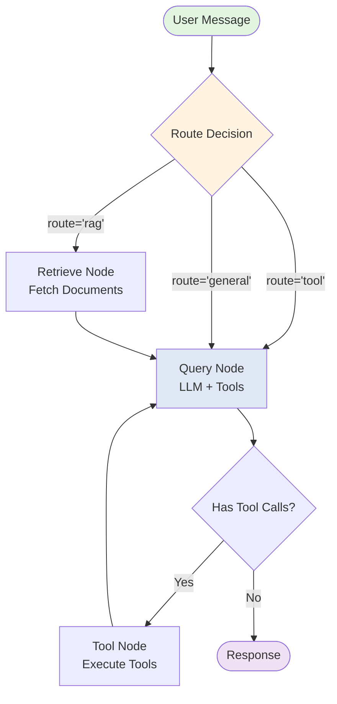

---

#### 3. MCP Client Management (`src/client/MCPClientManager.ts`)

The **MCPClientManager** handles multiple MCP server connections.

**Core Implementation:**

```typescript
export class MCPClientManager {
  private sessions = new Map<string, MCPSession>();
  private toolChangeListeners: (() => void)[] = [];

  /**
   * Subscribe to tool changes across all servers
   */
  onToolsChanged(callback: () => void): void {
    this.toolChangeListeners.push(callback);
  }

  private notifyToolChange() {
    this.toolChangeListeners.forEach((cb) => cb());
  }

  /**
   * Add and connect to a new MCP server
   */
  async addServer(config: MCPServerConfig): Promise<void> {
    if (this.sessions.has(config.id)) {
      throw new Error(`Server with id ${config.id} already exists`);
    }

    const session = new MCPSession(config);

    // Register callback for tool changes
    session.onToolsChanged(() => {
      console.log(`Tools changed for server ${config.id}`);
      this.notifyToolChange();
    });

    this.sessions.set(config.id, session);

    try {
      await session.connect();
      this.notifyToolChange(); // Notify that new tools are available
    } catch (error) {
      this.sessions.delete(config.id);
      throw error;
    }
  }

  /**
   * Get all available tools from all connected servers
   */
  getAllTools(): Array<Tool & { serverId: string }> {
    const tools: Array<Tool & { serverId: string }> = [];

    this.sessions.forEach((session, serverId) => {
      if (session.isConnected()) {
        session.tools.forEach((tool) => {
          tools.push({ ...tool, serverId });
        });
      }
    });

    return tools;
  }

  /**
   * Execute a tool on a specific server
   */
  async executeTool(
    serverId: string,
    toolName: string,
    args?: Record<string, unknown>
  ): Promise<ToolExecutionResult> {
    const session = this.sessions.get(serverId);

    if (!session) {
      return {
        success: false,
        error: `Server with id ${serverId} not found`,
      };
    }

    if (!session.isConnected()) {
      return {
        success: false,
        error: `Server ${serverId} is not connected`,
      };
    }

    return session.executeTool(toolName, args);
  }
}
```

**MCP Session (`src/client/MCPSession.ts`):**

```typescript
export class MCPSession {
  private client: Client;
  private transport?: StdioClientTransport;
  status: ServerStatus = "disconnected";
  tools: Tool[] = [];
  private toolChangeCallbacks: (() => void)[] = [];

  constructor(public config: MCPServerConfig) {
    this.client = new Client(
      {
        name: "study-agent-client",
        version: "1.0.0",
      },
      { capabilities: {} }
    );
  }

  async connect(): Promise<void> {
    if (this.config.transport === "stdio") {
      this.transport = new StdioClientTransport({
        command: this.config.command!,
        args: this.config.args || [],
        env: this.config.env as Record<string, string>,
      });

      await this.client.connect(this.transport);
      this.status = "connected";

      // Fetch available tools
      const result = await this.client.listTools();
      this.tools = result.tools;

      console.log(
        `Connected to ${this.config.name}, ${this.tools.length} tools available`
      );
    } else {
      throw new Error(
        `Transport type ${this.config.transport} not yet implemented`
      );
    }
  }

  async executeTool(
    toolName: string,
    args?: Record<string, unknown>
  ): Promise<ToolExecutionResult> {
    try {
      const result = await this.client.callTool({
        name: toolName,
        arguments: args || {},
      });

      return {
        success: true,
        result: result.content,
      };
    } catch (error) {
      return {
        success: false,
        error: error instanceof Error ? error.message : String(error),
      };
    }
  }

  onToolsChanged(callback: () => void): void {
    this.toolChangeCallbacks.push(callback);
  }
}
```

---

#### 4. RAG Service Integration

**RAG Client (`src/rag/rag-client.ts`):**

```typescript
export class RAGClient {
  private baseURL: string;
  private timeoutMs: number;

  constructor(
    baseURL: string = DEFAULT_BASE_URL,
    timeoutMs: number = DEFAULT_TIMEOUT_MS
  ) {
    this.baseURL = baseURL.replace(/\/$/, "");
    this.timeoutMs = timeoutMs;
  }

  /**
   * Check if the RAG service is healthy
   */
  async healthCheck(): Promise<HealthResponse> {
    try {
      const response = await fetch(`${this.baseURL}/health`, {
        method: "GET",
        signal: AbortSignal.timeout(5000),
      });

      if (!response.ok) {
        throw new RAGClientError(
          `Health check failed: ${response.status}`,
          response.status
        );
      }

      return await response.json();
    } catch (error) {
      const message = error instanceof Error ? error.message : String(error);
      logger.error(`RAG health check failed: ${message}`);
      throw new RAGClientError(`Health check failed: ${message}`);
    }
  }

  /**
   * Load a document into the vector store
   */
  async loadDocument(
    request: DocumentLoadRequest
  ): Promise<DocumentLoadResponse> {
    try {
      const response = await fetch(`${this.baseURL}/load_document`, {
        method: "POST",
        headers: { "Content-Type": "application/json" },
        body: JSON.stringify(request),
        signal: AbortSignal.timeout(this.timeoutMs),
      });

      if (!response.ok) {
        const error = await response.json();
        throw new RAGClientError(
          error.detail || "Failed to load document",
          response.status,
          error.detail
        );
      }

      return await response.json();
    } catch (error) {
      logger.error("Failed to load document:", error);
      throw error instanceof RAGClientError
        ? error
        : new RAGClientError(
            error instanceof Error ? error.message : String(error)
          );
    }
  }

  /**
   * Query the RAG system
   */
  async query(request: QueryRequest): Promise<QueryResponse> {
    try {
      const response = await fetch(`${this.baseURL}/query`, {
        method: "POST",
        headers: { "Content-Type": "application/json" },
        body: JSON.stringify(request),
        signal: AbortSignal.timeout(this.timeoutMs),
      });

      if (!response.ok) {
        const error = await response.json();
        throw new RAGClientError(
          error.detail || "Query failed",
          response.status,
          error.detail
        );
      }

      return await response.json();
    } catch (error) {
      logger.error("RAG query failed:", error);
      throw error instanceof RAGClientError
        ? error
        : new RAGClientError(
            error instanceof Error ? error.message : String(error)
          );
    }
  }
}

// Singleton instance
export const ragClient = new RAGClient();
```

**RAG Service Manager (`src/rag/rag-service-manager.ts`):**

Manages the Python FastAPI service as a subprocess.

```typescript
let ragServiceProcess: ChildProcess | null = null;
const DEFAULT_RAG_PORT = 8000;

export async function startRAGService(): Promise<void> {
  if (ragServiceProcess) {
    logger.info("RAG service already running");
    return;
  }

  const port = await findAvailablePort(getPreferredRAGPort());
  const pythonExe = getPythonExecutable();
  const scriptPath = path.join(
    __dirname,
    "..",
    "..",
    "python",
    "nvidia_rag_service.py"
  );

  logger.info(`Starting RAG service on port ${port}`);

  ragServiceProcess = spawn(pythonExe, [scriptPath], {
    env: {
      ...process.env,
      RAG_PORT: port.toString(),
      PYTHONUNBUFFERED: "1", // Disable output buffering
    },
    stdio: ["ignore", "pipe", "pipe"],
  });

  // Capture logs
  ragServiceProcess.stdout?.on("data", (data) => {
    logger.info(`[RAG Service] ${data.toString().trim()}`);
  });

  ragServiceProcess.stderr?.on("data", (data) => {
    logger.warn(`[RAG Service] ${data.toString().trim()}`);
  });

  // Wait for service to be ready
  await waitForServiceReady(port, STARTUP_TIMEOUT_MS);

  // Update RAG client base URL
  ragClient.setBaseURL(getBaseUrlForPort(port));
  activeRAGPort = port;

  logger.info("RAG service started successfully");
}

async function waitForServiceReady(
  port: number,
  timeoutMs: number
): Promise<void> {
  const startTime = Date.now();
  const checkInterval = HEALTH_CHECK_INTERVAL_MS;

  while (Date.now() - startTime < timeoutMs) {
    try {
      const response = await fetch(`http://localhost:${port}/health`, {
        signal: AbortSignal.timeout(2000),
      });
      if (response.ok) {
        return;
      }
    } catch {
      // Service not ready yet
    }
    await new Promise((resolve) => setTimeout(resolve, checkInterval));
  }

  throw new Error(`RAG service failed to start within ${timeoutMs}ms`);
}
```

---

#### 5. Python RAG Service (`python/nvidia_rag_service.py`)

The FastAPI backend that handles document processing and RAG queries.

**Key Endpoints:**

```python
@app.get("/health")
async def health_check():
    """Health check endpoint"""
    return {
        "status": "healthy" if embeddings and llm else "unhealthy",
        "nvidia_key_set": bool(NVIDIA_API_KEY),
        "persist_dir": CHROMA_PERSIST_DIR,
        "collection_name": COLLECTION_NAME,
        "embedding_model": EMBEDDING_MODEL,
        "llm_model": LLM_MODEL,
    }


@app.post("/load_document")
async def load_document(request: DocumentLoadRequest):
    """Load and embed a document into the vector store"""
    global vector_store

    if not os.path.exists(request.pdf_path):
        raise HTTPException(status_code=404, detail=f"File not found: {request.pdf_path}")

    try:
        # Load PDF
        loader = PyPDFLoader(request.pdf_path)
        documents = loader.load()

        # Split into chunks with semantic boundaries
        text_splitter = RecursiveCharacterTextSplitter(
            chunk_size=CHUNK_SIZE,
            chunk_overlap=CHUNK_OVERLAP,
            length_function=token_length_function,
            separators=SEMANTIC_SEPARATORS,
            is_separator_regex=False,
        )
        chunks = text_splitter.split_documents(documents)

        # Create or update vector store
        if vector_store is None:
            vector_store = Chroma.from_documents(
                documents=chunks,
                embedding=embeddings,
                collection_name=COLLECTION_NAME,
                persist_directory=CHROMA_PERSIST_DIR,
            )
        else:
            vector_store.add_documents(chunks)

        return {
            "status": "success",
            "chunks": len(chunks),
            "message": f"Loaded {len(chunks)} chunks from {request.pdf_path}",
        }
    except Exception as e:
        raise HTTPException(status_code=500, detail=str(e))


@app.post("/query")
async def query_rag(request: QueryRequest):
    """Query the RAG system"""
    global vector_store

    if vector_store is None:
        raise HTTPException(
            status_code=400,
            detail="No documents loaded. Please upload documents first.",
        )

    try:
        # Retrieve relevant documents
        retriever = vector_store.as_retriever(search_kwargs={"k": request.top_k or TOP_K_RETRIEVAL})
        docs = retriever.get_relevant_documents(request.question)

        # Format context
        context = "\n\n".join([f"[{i+1}] {doc.page_content}" for i, doc in enumerate(docs)])

        # Create prompt
        prompt = ChatPromptTemplate.from_messages([
            ("system", "You are a helpful study assistant. Use the following context to answer the question:\n\n{context}"),
            ("human", "{question}"),
        ])

        # Generate response
        chain = prompt | llm
        response = await chain.ainvoke({
            "context": context,
            "question": request.question,
        })

        return {
            "answer": response.content,
            "sources": [
                {
                    "content": doc.page_content,
                    "metadata": doc.metadata,
                }
                for doc in docs
            ],
            "chunks_retrieved": len(docs),
        }
    except Exception as e:
        raise HTTPException(status_code=500, detail=str(e))
```

**Token-Based Chunking Implementation:**

```python
def token_length_function(text: str) -> int:
    """Calculate token length for text using tiktoken"""
    if tokenizer:
        return len(tokenizer.encode(text))
    else:
        # Fallback: approximate 1 token ≈ 4 characters
        return len(text) // 4


# Optimized chunking configuration
CHUNK_SIZE = 512  # tokens (roughly 2000 characters)
CHUNK_OVERLAP = 128  # tokens (25% overlap)

# Semantic separators for better boundaries
SEMANTIC_SEPARATORS = [
    "\n\n\n",  # Chapter/section breaks
    "\n\n",    # Paragraph breaks
    "\n",      # Line breaks
    ". ",      # Sentence ends
    "! ",      # Exclamation ends
    "? ",      # Question ends
    "; ",      # Semicolon breaks
    ": ",      # Colon breaks
    ", ",      # Comma breaks
    " ",       # Word breaks
    "",        # Character breaks
]
```

---

### 🎨 UI Component Architecture

#### React Component Structure

**Main App (`src/App.tsx`):**

```typescript
export const App: React.FC = () => {
  const [activeView, setActiveView] = useState<"chat" | "servers" | "agent">("chat");
  const { isAuthenticated, user, logout } = useAuthStore();

  if (!isAuthenticated) {
    return <Login onNavigateToSignup={() => setAuthView("signup")} />;
  }

  return (
    <MainLayout
      sidebar={
        <div className="flex h-full">
          <Sidebar items={sidebarItems} header={sidebarHeader} footer={sidebarFooter} />
          {activeView === "chat" && <ChatSidebar />}
        </div>
      }
      topBar={<TopBar title="Study Assistant" actions={topBarActions} />}
    >
      {activeView === "chat" && <Chat />}
      {activeView === "servers" && <ServerManager />}
      {activeView === "agent" && <AgentConsole />}
    </MainLayout>
  );
};
```

**Chat Interface (`src/views/Chat.tsx`):**

```typescript
export const Chat: React.FC = () => {
  const [messages, setMessages] = useState<Message[]>([]);
  const [input, setInput] = useState("");
  const [isLoading, setIsLoading] = useState(false);
  const [pendingToolCall, setPendingToolCall] = useState<PendingToolCall | null>(null);

  const handleSend = async () => {
    if (!input.trim() || isLoading) return;

    const userMessage: Message = {
      id: `msg-${Date.now()}`,
      role: "user",
      content: input,
      timestamp: new Date(),
    };

    setMessages((prev) => [...prev, userMessage]);
    setInput("");
    setIsLoading(true);

    try {
      // Send to agent via IPC
      const response = await window.electronAPI.sendMessage(input);

      const assistantMessage: Message = {
        id: `msg-${Date.now()}`,
        role: "assistant",
        content: response.response,
        timestamp: new Date(),
        toolCalls: response.toolCalls,
      };

      setMessages((prev) => [...prev, assistantMessage]);
    } catch (error) {
      console.error("Failed to send message:", error);
    } finally {
      setIsLoading(false);
    }
  };

  return (
    <ContentContainer>
      <div className="flex flex-col h-full">
        {/* Messages */}
        <div className="flex-1 overflow-y-auto p-6 space-y-4">
          {messages.length === 0 ? (
            <WelcomeScreen onQuickAction={(prompt) => setInput(prompt)} />
          ) : (
            messages.map((message) => (
              <MessageBubble key={message.id} message={message} />
            ))
          )}
          {isLoading && <LoadingSpinner />}
        </div>

        {/* Input Area */}
        <div className="p-4 border-t border-gray-200">
          <div className="flex gap-3">
            <TextArea
              value={input}
              onChange={(e) => setInput(e.target.value)}
              placeholder="Ask me anything about your study materials..."
              rows={3}
            />
            <Button onClick={handleSend} disabled={isLoading || !input.trim()}>
              <Send className="w-5 h-5" />
            </Button>
          </div>
        </div>
      </div>
    </ContentContainer>
  );
};
```

**Markdown Renderer (`src/components/ui/MarkdownRenderer.tsx`):**

```typescript
export const MarkdownRenderer: React.FC<{ content: string }> = ({ content }) => {
  return (
    <ReactMarkdown
      className="markdown-body"
      remarkPlugins={[remarkGfm, remarkMath]}
      rehypePlugins={[rehypeKatex]}
      components={{
        code({ node, inline, className, children, ...props }) {
          const match = /language-(\w+)/.exec(className || "");
          return !inline && match ? (
            <SyntaxHighlighter
              style={vscDarkPlus}
              language={match[1]}
              PreTag="div"
              {...props}
            >
              {String(children).replace(/\n$/, "")}
            </SyntaxHighlighter>
          ) : (
            <code className={className} {...props}>
              {children}
            </code>
          );
        },
      }}
    >
      {content}
    </ReactMarkdown>
  );
};
```

---

### 🔐 IPC Communication & Security

**Preload Script (`src/preload.ts`):**

```typescript
import { contextBridge, ipcRenderer } from "electron";

// Expose safe APIs to renderer
contextBridge.exposeInMainWorld("electronAPI", {
  // Chat
  sendMessage: (message: string) => ipcRenderer.invoke("send-message", message),
  onMessageReceived: (callback: (data: any) => void) => {
    ipcRenderer.on("message-received", (_event, data) => callback(data));
  },

  // Document Upload
  uploadDocument: () => ipcRenderer.invoke("upload-document"),
  onDocumentUploaded: (callback: (result: any) => void) => {
    ipcRenderer.on("document-uploaded", (_event, result) => callback(result));
  },

  // MCP Servers
  addMCPServer: (config: any) => ipcRenderer.invoke("add-mcp-server", config),
  removeMCPServer: (serverId: string) =>
    ipcRenderer.invoke("remove-mcp-server", serverId),
  getMCPServers: () => ipcRenderer.invoke("get-mcp-servers"),

  // Agent Status
  getAgentStatus: () => ipcRenderer.invoke("get-agent-status"),
});

// Type definitions for renderer
declare global {
  interface Window {
    electronAPI: {
      sendMessage: (message: string) => Promise<any>;
      onMessageReceived: (callback: (data: any) => void) => void;
      uploadDocument: () => Promise<any>;
      onDocumentUploaded: (callback: (result: any) => void) => void;
      addMCPServer: (config: any) => Promise<void>;
      removeMCPServer: (serverId: string) => Promise<void>;
      getMCPServers: () => Promise<any[]>;
      getAgentStatus: () => Promise<any>;
    };
  }
}
```

**Main Process IPC Handlers (`src/index.ts`):**

```typescript
import { ipcMain, dialog } from "electron";
import { studyAgentService } from "./agent/StudyAgentService";
import { mcpManager } from "./client/MCPClientManager";

// Chat message handler
ipcMain.handle("send-message", async (_event, message: string) => {
  try {
    const result = await studyAgentService.invoke(message);
    return result;
  } catch (error) {
    console.error("Failed to process message:", error);
    return {
      success: false,
      error: error instanceof Error ? error.message : String(error),
    };
  }
});

// Document upload handler
ipcMain.handle("upload-document", async () => {
  const result = await dialog.showOpenDialog({
    properties: ["openFile", "multiSelections"],
    filters: [
      { name: "Documents", extensions: ["pdf", "txt", "md"] },
      { name: "All Files", extensions: ["*"] },
    ],
  });

  if (result.canceled || result.filePaths.length === 0) {
    return { success: false, error: "No file selected" };
  }

  try {
    const uploadResult = await studyAgentService.addDocuments(result.filePaths);
    return uploadResult;
  } catch (error) {
    return {
      success: false,
      error: error instanceof Error ? error.message : String(error),
    };
  }
});

// MCP server management
ipcMain.handle("add-mcp-server", async (_event, config) => {
  try {
    await mcpManager.addServer(config);
    return { success: true };
  } catch (error) {
    return {
      success: false,
      error: error instanceof Error ? error.message : String(error),
    };
  }
});

ipcMain.handle("get-mcp-servers", async () => {
  return mcpManager.getAllServers();
});
```

---

### 🧪 Testing Strategy

#### Unit Tests

**Agent Service Tests (`tests/test-agent-e2e.ts`):**

```typescript
import { StudyAgentService } from "../src/agent/StudyAgentService";
import { MCPClientManager } from "../src/client/MCPClientManager";

describe("StudyAgentService", () => {
  let agent: StudyAgentService;

  beforeEach(async () => {
    agent = new StudyAgentService();
    await agent.initialize();
  });

  test("should initialize successfully", () => {
    expect(agent).toBeDefined();
  });

  test("should handle general queries", async () => {
    const result = await agent.invoke("What is machine learning?");
    expect(result.success).toBe(true);
    expect(result.response).toBeTruthy();
  });

  test("should route to RAG for document queries", async () => {
    // First upload a document
    await agent.addDocuments(["./test-fixtures/sample.pdf"]);

    const result = await agent.invoke("What does the document say about AI?");
    expect(result.success).toBe(true);
    expect(result.metadata?.route).toBe("rag");
  });

  test("should handle tool execution", async () => {
    const result = await agent.invoke(
      "Create flashcards about Python functions"
    );
    expect(result.success).toBe(true);
    expect(result.metadata?.route).toBe("tool");
  });
});
```

#### Integration Tests

**RAG Pipeline Tests (`tests/test-rag-pipeline.ts`):**

```typescript
import { ragClient } from "../src/rag/rag-client";
import {
  startRAGService,
  stopRAGService,
} from "../src/rag/rag-service-manager";

describe("RAG Pipeline", () => {
  beforeAll(async () => {
    await startRAGService();
    // Wait for service to be ready
    await new Promise((resolve) => setTimeout(resolve, 5000));
  });

  afterAll(async () => {
    await stopRAGService();
  });

  test("health check should pass", async () => {
    const health = await ragClient.healthCheck();
    expect(health.status).toBe("healthy");
    expect(health.nvidia_key_set).toBe(true);
  });

  test("should load document successfully", async () => {
    const result = await ragClient.loadDocument({
      pdf_path: "./test-fixtures/sample.pdf",
    });
    expect(result.status).toBe("success");
    expect(result.chunks).toBeGreaterThan(0);
  });

  test("should query with context", async () => {
    const result = await ragClient.query({
      question: "What is the main topic of the document?",
      top_k: 3,
    });
    expect(result.answer).toBeTruthy();
    expect(result.sources.length).toBeGreaterThan(0);
  });
});
```

---

### 🐛 Debugging & Troubleshooting

#### Common Issues

**1. RAG Service Won't Start**

```typescript
// Check Python environment
const pythonVersion = await execAsync("python --version");
console.log("Python version:", pythonVersion);

// Check dependencies
const pipList = await execAsync("pip list");
console.log("Installed packages:", pipList);

// Check port availability
const isPortFree = await isPortAvailable(8000);
console.log("Port 8000 available:", isPortFree);
```

**Solution:**

- Ensure Python 3.11+ is installed
- Run `pip install -r python/requirements.txt`
- Check if port 8000 is already in use

**2. NVIDIA API Rate Limiting**

```python
# Implement exponential backoff
async def query_with_retry(query: str, max_retries: int = 3):
    for attempt in range(max_retries):
        try:
            return await llm.ainvoke(query)
        except RateLimitError:
            if attempt < max_retries - 1:
                wait_time = 2 ** attempt  # Exponential backoff
                await asyncio.sleep(wait_time)
            else:
                raise
```

**3. MCP Server Connection Failures**

```typescript
// Add timeout and retry logic
async function connectWithRetry(
  session: MCPSession,
  maxRetries: number = 3
): Promise<void> {
  for (let attempt = 0; attempt < maxRetries; attempt++) {
    try {
      await session.connect();
      return;
    } catch (error) {
      if (attempt === maxRetries - 1) throw error;
      await new Promise((resolve) => setTimeout(resolve, 1000 * (attempt + 1)));
    }
  }
}
```

#### Logging Configuration

```typescript
import winston from "winston";

export const logger = winston.createLogger({
  level: process.env.LOG_LEVEL || "info",
  format: winston.format.combine(
    winston.format.timestamp(),
    winston.format.errors({ stack: true }),
    winston.format.splat(),
    winston.format.json()
  ),
  transports: [
    new winston.transports.File({ filename: "logs/error.log", level: "error" }),
    new winston.transports.File({ filename: "logs/combined.log" }),
    new winston.transports.Console({
      format: winston.format.combine(
        winston.format.colorize(),
        winston.format.simple()
      ),
    }),
  ],
});
```

---

### 📦 Build & Packaging

#### Webpack Configuration

**Main Process (`webpack.main.config.ts`):**

```typescript
import type { Configuration } from "webpack";
import { rules } from "./webpack.rules";

export const mainConfig: Configuration = {
  entry: "./src/index.ts",
  module: { rules },
  resolve: {
    extensions: [".js", ".ts", ".jsx", ".tsx", ".css", ".json"],
  },
  externals: {
    "better-sqlite3": "commonjs2 better-sqlite3",
    chromadb: "commonjs2 chromadb",
  },
};
```

**Renderer Process (`webpack.renderer.config.ts`):**

```typescript
import type { Configuration } from "webpack";
import { rules } from "./webpack.rules";
import { plugins } from "./webpack.plugins";

export const rendererConfig: Configuration = {
  module: { rules },
  plugins,
  resolve: {
    extensions: [".js", ".ts", ".jsx", ".tsx", ".css"],
  },
};
```

#### Electron Forge Configuration

```typescript
import type { ForgeConfig } from "@electron-forge/shared-types";
import { MakerSquirrel } from "@electron-forge/maker-squirrel";
import { MakerZIP } from "@electron-forge/maker-zip";
import { MakerDeb } from "@electron-forge/maker-deb";
import { MakerRpm } from "@electron-forge/maker-rpm";
import { WebpackPlugin } from "@electron-forge/plugin-webpack";

const config: ForgeConfig = {
  packagerConfig: {
    name: "AI Study Agent",
    executableName: "ai-study-agent",
    icon: "./assets/icon",
  },
  makers: [
    new MakerSquirrel({}),
    new MakerZIP({}, ["darwin"]),
    new MakerDeb({}),
    new MakerRpm({}),
  ],
  plugins: [
    new WebpackPlugin({
      mainConfig,
      renderer: {
        config: rendererConfig,
        entryPoints: [
          {
            html: "./src/index.html",
            js: "./src/renderer.ts",
            name: "main_window",
            preload: {
              js: "./src/preload.ts",
            },
          },
        ],
      },
    }),
  ],
};

export default config;
```

---

### 🎯 Performance Optimization

#### 1. Lazy Loading

```typescript
// Lazy load agent only when needed
let agentInstance: StudyAgentService | null = null;

export function getAgentService(): StudyAgentService {
  if (!agentInstance) {
    agentInstance = new StudyAgentService();
  }
  return agentInstance;
}
```

#### 2. Caching Strategy

```typescript
// Cache embeddings in memory
const embeddingCache = new Map<string, number[]>();

async function getEmbedding(text: string): Promise<number[]> {
  const cacheKey = hashString(text);

  if (embeddingCache.has(cacheKey)) {
    return embeddingCache.get(cacheKey)!;
  }

  const embedding = await generateEmbedding(text);
  embeddingCache.set(cacheKey, embedding);
  return embedding;
}
```

#### 3. Batch Processing

```python
# Batch document processing
async def load_documents_batch(paths: List[str], batch_size: int = 5):
    for i in range(0, len(paths), batch_size):
        batch = paths[i:i + batch_size]
        await asyncio.gather(*[load_single_document(path) for path in batch])
```

---

## Phase 3: Deployment & Usage

### 📦 Installation & Setup

#### Prerequisites

Before installing the AI Study Agent, ensure your system meets the following requirements:

| Requirement          | Version                          | Purpose                          |
| -------------------- | -------------------------------- | -------------------------------- |
| **Node.js**          | 18.x or higher                   | JavaScript runtime for Electron  |
| **npm**              | 9.x or higher                    | Package manager                  |
| **Python**           | 3.11 or higher                   | Backend RAG service              |
| **pip**              | 23.x or higher                   | Python package manager           |
| **Git**              | 2.x or higher                    | Version control                  |
| **Operating System** | macOS 10.15+, Windows 10+, Linux | Desktop platform                 |
| **RAM**              | 8GB minimum, 16GB recommended    | For AI model processing          |
| **Disk Space**       | 2GB minimum                      | For application and dependencies |

#### System Requirements by Platform

**macOS:**

- macOS Catalina (10.15) or later
- Apple Silicon (M1/M2) or Intel processor
- Xcode Command Line Tools: `xcode-select --install`

**Windows:**

- Windows 10 version 1809 or later
- Windows Subsystem for Linux (WSL2) recommended for development
- Visual Studio Build Tools for native modules

**Linux:**

- Ubuntu 20.04+, Fedora 35+, or equivalent
- GCC compiler and build essentials
- GTK+ 3.0 development libraries

---

#### Step 1: Clone the Repository

```bash
# Clone the repository
git clone https://github.com/lakshya4568/study-agent-RAG.git
cd study-agent-RAG

# Switch to development branch (if needed)
git checkout dev_final
```

---

#### Step 2: Install Node.js Dependencies

```bash
# Install all Node.js packages
npm install

# This installs:
# - Electron and Electron Forge
# - React and UI libraries
# - LangChain and LangGraph
# - MCP SDK and adapters
# - TypeScript and build tools
# - All development dependencies
```

**Common Installation Issues:**

- **Error: `node-gyp` build failures** → Install platform-specific build tools (see prerequisites)
- **Error: Permission denied** → Use `sudo` on macOS/Linux or run as Administrator on Windows
- **Error: Network timeout** → Configure npm registry or use VPN if behind firewall

---

#### Step 3: Set Up Python Environment

**Option A: Using Virtual Environment (Recommended)**

```bash
# Create Python virtual environment
python3 -m venv .venv

# Activate virtual environment
# On macOS/Linux:
source .venv/bin/activate

# On Windows (PowerShell):
.venv\Scripts\Activate.ps1

# On Windows (Command Prompt):
.venv\Scripts\activate.bat

# Install Python dependencies
pip install -r python/requirements.txt
```

**Option B: Using Conda**

```bash
# Create conda environment
conda create -n study-agent python=3.11

# Activate environment
conda activate study-agent

# Install dependencies
pip install -r python/requirements.txt
```

**Python Dependencies Installed:**

- `fastapi` → Web framework for RAG service
- `uvicorn` → ASGI server
- `langchain` → LLM orchestration
- `langchain-nvidia-ai-endpoints` → NVIDIA model integration
- `chromadb` → Vector database
- `pypdf` → PDF document parsing
- `tiktoken` → Token counting
- `python-dotenv` → Environment variable management

---

#### Step 4: Configure Environment Variables

Create a `.env` file in the project root directory:

```bash
# Copy example environment file
cp .env.example .env

# Edit with your preferred editor
nano .env  # or vim, code, etc.
```

**Required Environment Variables:**

```bash
# === AI Model Configuration ===
NVIDIA_API_KEY=your_nvidia_api_key_here

# === Model Selection ===
NVIDIA_EMBEDDING_MODEL=nvidia/llama-3.2-nemoretriever-300m-embed-v2
NVIDIA_LLM_MODEL=moonshotai/kimi-k2-instruct

# === RAG Service Configuration ===
RAG_PORT=8000
CHROMA_PERSIST_DIR=./chroma_db
COLLECTION_NAME=study_materials

# === Chunking Configuration ===
CHUNK_SIZE=512
CHUNK_OVERLAP=128
TOP_K_RETRIEVAL=5

# === Logging ===
LOG_LEVEL=info

# === Optional: Advanced Settings ===
MAX_TOKENS=4096
TEMPERATURE=0.7
```

**How to Get API Keys:**

**NVIDIA API Key:**

1. Visit [NVIDIA API Catalog](https://build.nvidia.com/)
2. Create a free account or log in
3. Navigate to "API Keys" section
4. Generate a new API key
5. Copy and paste into `.env` file
6. **Rate Limit:** Free tier provides 40 requests per minute

**Important Security Notes:**

- ⚠️ Never commit `.env` file to version control
- ✅ `.env` is already in `.gitignore`
- 🔒 Keep API keys private and secure
- 🔄 Rotate keys regularly for security

---

#### Step 5: Verify Installation

Run the verification script to ensure everything is set up correctly:

```bash
# Test Python environment
python python/nvidia_rag_service.py --test

# Expected output:
# ✅ Python version: 3.11.x
# ✅ All dependencies installed
# ✅ NVIDIA API key configured
# ✅ ChromaDB initialized
```

```bash
# Test TypeScript compilation
npm run build

# Expected output:
# ✅ TypeScript compiled successfully
# ✅ Main process bundle created
# ✅ Renderer process bundle created
# ✅ No type errors found
```

---

### 🚀 Running the Application

#### Development Mode

**Start the application in development mode with hot-reload:**

```bash
# Start both Electron and RAG service
npm start

# This command:
# 1. Compiles TypeScript with Webpack
# 2. Starts the Python RAG service automatically
# 3. Launches Electron with DevTools open
# 4. Enables hot-reload for code changes
```

**What Happens on Startup:**

1. **Python RAG Service** starts on port 8000 (or next available)
2. **Electron Main Process** initializes window and IPC handlers
3. **MCP Client Manager** connects to configured servers
4. **Study Agent Service** initializes LangGraph workflow
5. **React UI** renders in Electron renderer process
6. **ChromaDB** loads persisted embeddings (if any)

**Development Features:**

- 🔄 Hot reload for renderer changes
- 🛠️ DevTools open by default
- 📝 Detailed console logging
- 🔍 React Developer Tools integration

---

#### Production Mode

**Build and package the application for distribution:**

```bash
# Create production build
npm run package

# This creates an executable in the 'out' directory
# No installer, just the executable application

# Create platform-specific installers
npm run make

# This creates installers in the 'out/make' directory:
# - macOS: .dmg file
# - Windows: .exe installer
# - Linux: .deb, .rpm packages
```

**Output Structure:**

```
out/
├── ai-study-agent-darwin-x64/       # macOS build
│   └── AI Study Agent.app
├── ai-study-agent-win32-x64/        # Windows build
│   └── AI Study Agent.exe
├── ai-study-agent-linux-x64/        # Linux build
│   └── ai-study-agent
└── make/
    ├── AI Study Agent-1.0.0.dmg     # macOS installer
    ├── AI Study Agent Setup 1.0.0.exe  # Windows installer
    ├── ai-study-agent_1.0.0_amd64.deb  # Debian/Ubuntu
    └── ai-study-agent-1.0.0.x86_64.rpm # Fedora/RHEL
```

---

### ⚙️ Configuration Guide

#### MCP Server Configuration

MCP servers extend the agent's capabilities. Configure them in `.vscode/mcp.json`:

```json
{
  "mcpServers": {
    "mcp-time": {
      "type": "stdio",
      "command": "npx",
      "args": ["-y", "@theo.foobar/mcp-time@0.4.0"],
      "env": {}
    },
    "custom-study-tools": {
      "type": "stdio",
      "command": "node",
      "args": ["./src/mcp-servers/study-tools.js"],
      "env": {
        "TOOL_ENV": "production"
      }
    }
  }
}
```

**MCP Server Types:**

- **STDIO:** Local processes communicating via standard input/output
- **HTTP:** Remote servers with REST API endpoints
- **SSE:** Server-Sent Events for real-time streaming

**Available MCP Servers:**
| Server | Purpose | Installation |
|--------|---------|-------------|
| `@theo.foobar/mcp-time` | Time/date operations | `npx -y @theo.foobar/mcp-time@0.4.0` |
| `@modelcontextprotocol/server-filesystem` | File system access | `npx @modelcontextprotocol/server-filesystem` |
| `@modelcontextprotocol/server-google-drive` | Google Drive integration | Requires OAuth setup |
| Custom servers | Your own tools | Implement MCP protocol |

**Adding a New MCP Server:**

1. Add configuration to `mcp.json`
2. Restart application
3. Server tools appear automatically in agent
4. No code changes required

---

#### Agent Configuration

Customize agent behavior in `src/agent/StudyAgentService.ts`:

**Key Configuration Options:**

```typescript
const agentOptions = {
  // LLM Settings
  modelName: "moonshotai/kimi-k2-instruct",
  temperature: 0.7, // Creativity (0.0-1.0)
  maxTokens: 4096, // Response length limit

  // RAG Settings
  topK: 5, // Number of chunks to retrieve
  ragEnabled: true, // Enable/disable RAG

  // Routing Settings
  routingMode: "auto", // "auto" | "manual" | "llm-based"

  // Performance
  cachingEnabled: true, // Cache embeddings
  streamResponses: false, // Stream vs batch responses
};
```

**Routing Modes Explained:**

- **auto:** Heuristic-based routing (fast, efficient)
- **manual:** User specifies route explicitly
- **llm-based:** LLM decides routing (slower, more accurate)

---

#### Database Configuration

ChromaDB settings for vector storage:

```python
# In python/nvidia_rag_service.py

CHROMA_PERSIST_DIR = os.getenv("CHROMA_PERSIST_DIR", "./chroma_db")
COLLECTION_NAME = os.getenv("COLLECTION_NAME", "study_materials")

# Advanced settings
chroma_client = chromadb.PersistentClient(
    path=CHROMA_PERSIST_DIR,
    settings=Settings(
        anonymized_telemetry=False,    # Disable telemetry
        allow_reset=True,               # Allow clearing database
    )
)
```

**Database Maintenance:**

```bash
# Clear all embeddings (useful for fresh start)
rm -rf chroma_db/*

# Backup database
cp -r chroma_db chroma_db_backup_$(date +%Y%m%d)

# Check database size
du -sh chroma_db/
```

---

### 🎮 Usage Guide

#### First-Time Setup Workflow

**1. Launch Application**

```bash
npm start
```

**2. Authenticate (Optional)**

- Create account or log in
- Authentication stores user preferences
- Not required for basic functionality

**3. Upload Study Materials**

- Click "Upload Document" button
- Select PDF, TXT, or Markdown files
- Multiple files can be uploaded
- Processing takes 10-30 seconds per document

**What Happens During Upload:**

```
User selects file
    ↓
File sent to RAG service
    ↓
PDF parsed into text
    ↓
Text split into 512-token chunks
    ↓
Each chunk embedded with NVIDIA API
    ↓
Embeddings stored in ChromaDB
    ↓
Success notification shown
```

**4. Start Chatting**

- Type questions in chat interface
- Agent automatically routes queries
- Responses include source citations

---

#### Chat Interface Features

**Message Types:**

**📝 General Questions:**

```
User: "What is machine learning?"
Agent: [General knowledge response without RAG]
```

**📚 Document-Based Questions:**

```
User: "What does my study material say about neural networks?"
Agent: [Response with context from uploaded PDFs + citations]

Sources:
[1] Chapter 3, page 45: "Neural networks consist of..."
[2] Lecture Notes, page 12: "Deep learning architectures..."
```

**🔧 Tool-Using Questions:**

```
User: "Create flashcards about Python functions"
Agent: [Uses MCP tool to generate flashcards]
Result: 10 flashcards created
```

**Quick Action Buttons:**

- 📄 Summarize Document
- 🎴 Generate Flashcards
- 📝 Create Quiz
- 💡 Explain Concept
- 🔍 Find Related Topics

---

#### Document Management

**Supported File Formats:**

- **PDF:** `.pdf` (most common for textbooks, papers)
- **Text:** `.txt` (plain text notes)
- **Markdown:** `.md` (formatted notes)
- **Future:** `.docx`, `.pptx` (coming soon)

**Document Processing Settings:**

```bash
# Optimal settings for different document types

# Dense textbooks (lots of info per page)
CHUNK_SIZE=512
CHUNK_OVERLAP=128

# Simple lecture notes (sparse content)
CHUNK_SIZE=256
CHUNK_OVERLAP=64

# Research papers (technical, specific)
CHUNK_SIZE=768
CHUNK_OVERLAP=192
```

**Best Practices:**

- ✅ Upload complete chapters/sections together
- ✅ Use descriptive filenames
- ✅ Keep related materials in same upload session
- ❌ Don't mix unrelated subjects
- ❌ Avoid uploading duplicate content

---

#### Advanced Features

**1. Conversation Memory**

The agent maintains conversation context using LangGraph checkpointing:

```typescript
// Each conversation has a unique thread ID
const threadId = "study-session-2024-11-21";

// Messages persist across sessions
await agent.invoke("What did we discuss earlier?", threadId);
```

**Memory Features:**

- ✅ Conversations persist between app restarts
- ✅ Multiple conversation threads supported
- ✅ Full message history available
- ✅ Context window: Last 10 messages

**2. Tool Approval System**

For sensitive operations, the agent requests approval:

```
Agent: I need to execute the "create_quiz" tool with your study material.

      Tool: create_quiz
      Arguments:
        - topic: "Neural Networks"
        - num_questions: 10
        - difficulty: "medium"

      [Approve] [Deny] [Modify]
```

**3. Source Citations**

All RAG responses include source citations:

```
Answer: Neural networks are composed of interconnected layers...

Sources:
[1] Deep Learning Basics.pdf, Page 23, Chunk 5
    "A neural network consists of an input layer..."
    Relevance: 0.92

[2] ML Lecture Notes.pdf, Page 8, Chunk 2
    "Each neuron receives inputs, applies weights..."
    Relevance: 0.87
```

**4. Export Capabilities**

Export conversations and study materials:

```bash
# Export chat history
File → Export Chat → chat_history_2024-11-21.json

# Export flashcards
Tools → Export Flashcards → flashcards.csv

# Export quiz
Tools → Export Quiz → quiz.pdf
```

---

### 📊 Monitoring & Logs

#### Application Logs

Logs are stored in the `logs/` directory:

```
logs/
├── combined.log          # All logs (info, warn, error)
├── error.log             # Error logs only
└── rag-service.log       # Python RAG service logs
```

**Log Levels:**

- **debug:** Detailed diagnostic information
- **info:** General informational messages
- **warn:** Warning messages (non-critical)
- **error:** Error messages (critical issues)

**Viewing Logs:**

```bash
# View all logs
tail -f logs/combined.log

# View only errors
tail -f logs/error.log

# View RAG service logs
tail -f logs/rag-service.log

# Search logs for specific term
grep "NVIDIA API" logs/combined.log
```

#### Performance Monitoring

**Built-in Metrics:**

| Metric               | Description              | Target      |
| -------------------- | ------------------------ | ----------- |
| Initialization Time  | Agent startup duration   | < 5 seconds |
| Query Latency        | Time to respond to query | 1-3 seconds |
| RAG Retrieval Time   | Vector search duration   | < 100ms     |
| Embedding Generation | Time per chunk           | ~50ms       |
| Memory Usage         | RAM consumption          | < 500MB     |
| CPU Usage            | Processor utilization    | < 30% idle  |

**Accessing Metrics:**

```typescript
// In Agent Console view
const status = await window.electronAPI.getAgentStatus();

console.log(status.metrics);
// {
//   initializationTimeMs: 3421,
//   lastQueryLatencyMs: 1834,
//   totalQueries: 47,
//   ragQueries: 23,
//   toolQueries: 12,
//   generalQueries: 12,
//   documentsLoaded: 5,
//   totalChunks: 423,
//   uptime: 1847391
// }
```

---

### 🐛 Troubleshooting

#### Common Issues & Solutions

**Issue 1: RAG Service Won't Start**

**Symptoms:**

- "RAG service not available" error
- Timeout when uploading documents
- Agent console shows RAG as disconnected

**Solutions:**

```bash
# Check if Python is installed correctly
python3 --version
# Should output: Python 3.11.x or higher

# Check if dependencies are installed
pip list | grep langchain
# Should show langchain and related packages

# Manually start RAG service for debugging
python python/nvidia_rag_service.py
# Check for error messages

# Check if port 8000 is available
lsof -i :8000  # macOS/Linux
netstat -ano | findstr :8000  # Windows

# Try alternative port
RAG_PORT=8001 python python/nvidia_rag_service.py
```

---

**Issue 2: NVIDIA API Errors**

**Symptoms:**

- "Invalid API key" error
- Rate limit exceeded messages
- Connection timeout to NVIDIA

**Solutions:**

```bash
# Verify API key is set
echo $NVIDIA_API_KEY
# Should output your API key

# Test API key directly
curl -H "Authorization: Bearer YOUR_API_KEY" \
  https://integrate.api.nvidia.com/v1/models
# Should return list of available models

# Check rate limiting
# Free tier: 40 requests/minute
# Solution: Implement delays between requests

# Check internet connectivity
ping integrate.api.nvidia.com
```

**Rate Limit Handling:**

```python
# Automatic retry with exponential backoff
# Already implemented in the RAG service

# Manual rate limiting (if needed)
import time
time.sleep(1.5)  # Wait 1.5 seconds between requests
```

---

**Issue 3: MCP Server Connection Failures**

**Symptoms:**

- "Failed to connect to server" error
- Tools not appearing in agent
- Server status shows "disconnected"

**Solutions:**

```bash
# Check MCP server configuration
cat .vscode/mcp.json
# Verify command and args are correct

# Test server manually
npx -y @theo.foobar/mcp-time@0.4.0
# Should start without errors

# Check server logs
# Logs appear in Electron DevTools console

# Remove and re-add server
# Use Server Manager UI or edit mcp.json
```

---

**Issue 4: High Memory Usage**

**Symptoms:**

- Application becomes slow
- System RAM usage > 2GB
- Frequent freezing

**Solutions:**

```bash
# Clear embedding cache
rm -rf chroma_db/*
# Re-upload documents

# Reduce chunk size (less memory per embedding)
# Edit .env file:
CHUNK_SIZE=256
CHUNK_OVERLAP=64

# Limit conversation history
# Edit agent settings to keep only last 5 messages

# Restart application periodically
# Memory is freed on restart
```

---

**Issue 5: Document Upload Failures**

**Symptoms:**

- "Failed to load document" error
- Upload progress stalls
- Corrupted PDF errors

**Solutions:**

```bash
# Verify file is valid PDF
file document.pdf
# Should output: "PDF document"

# Check file size (very large files may timeout)
ls -lh document.pdf
# Recommended: < 50MB per file

# Try re-exporting PDF
# Some PDFs have compatibility issues
# Use Adobe Acrobat or Preview to re-save

# Check file permissions
chmod 644 document.pdf

# Try splitting large documents
# Use PDF tools to split into smaller files
```

---

**Issue 6: UI Not Responding**

**Symptoms:**

- Blank white screen
- Buttons don't work
- React errors in console

**Solutions:**

```bash
# Clear Electron cache
rm -rf ~/Library/Application\ Support/ai-study-agent  # macOS
rm -rf ~/.config/ai-study-agent  # Linux
del /F /S /Q %APPDATA%\ai-study-agent  # Windows

# Rebuild application
npm run clean
npm install
npm start

# Check for JavaScript errors
# Open DevTools (Cmd+Option+I / Ctrl+Shift+I)
# Look for red errors in Console tab

# Update dependencies
npm update
```

---

### 🔧 Advanced Configuration

#### Custom Model Configuration

Use alternative AI models (requires compatible OpenAI API):

```bash
# In .env file

# Use OpenAI instead of NVIDIA
OPENAI_API_KEY=your_openai_key
OPENAI_MODEL=gpt-4-turbo

# Use Azure OpenAI
AZURE_OPENAI_KEY=your_azure_key
AZURE_OPENAI_ENDPOINT=https://your-endpoint.openai.azure.com/
AZURE_OPENAI_DEPLOYMENT=gpt-4

# Use local Ollama models
OLLAMA_BASE_URL=http://localhost:11434
OLLAMA_MODEL=llama2:13b
```

**Code Changes Required:**

```typescript
// Update src/models/nvidia-openai-chat.ts
const llm = new ChatOpenAI({
  modelName: process.env.OPENAI_MODEL || "gpt-4-turbo",
  openAIApiKey: process.env.OPENAI_API_KEY,
  // No custom baseURL needed for OpenAI
});
```

---

#### Custom MCP Server Development

Create your own tools by implementing MCP protocol:

**Example: Weather Tool Server**

```typescript
// my-weather-server.ts
import { Server } from "@modelcontextprotocol/sdk/server/index.js";
import { StdioServerTransport } from "@modelcontextprotocol/sdk/server/stdio.js";

const server = new Server(
  {
    name: "weather-server",
    version: "1.0.0",
  },
  {
    capabilities: {
      tools: {},
    },
  }
);

// Register tool
server.setRequestHandler("tools/list", async () => ({
  tools: [
    {
      name: "get_weather",
      description: "Get current weather for a location",
      inputSchema: {
        type: "object",
        properties: {
          location: { type: "string" },
        },
        required: ["location"],
      },
    },
  ],
}));

// Handle tool execution
server.setRequestHandler("tools/call", async (request) => {
  if (request.params.name === "get_weather") {
    const location = request.params.arguments?.location;
    // Fetch weather data
    return {
      content: [
        {
          type: "text",
          text: `Weather in ${location}: Sunny, 72°F`,
        },
      ],
    };
  }
});

// Start server
const transport = new StdioServerTransport();
await server.connect(transport);
```

**Add to mcp.json:**

```json
{
  "mcpServers": {
    "weather": {
      "type": "stdio",
      "command": "node",
      "args": ["./my-weather-server.js"]
    }
  }
}
```

---

#### Database Backup & Restore

**Backup Strategy:**

```bash
#!/bin/bash
# backup-rag-data.sh

BACKUP_DIR="backups/$(date +%Y%m%d_%H%M%S)"
mkdir -p "$BACKUP_DIR"

# Backup vector database
cp -r chroma_db "$BACKUP_DIR/chroma_db"

# Backup configuration
cp .env "$BACKUP_DIR/.env"
cp .vscode/mcp.json "$BACKUP_DIR/mcp.json"

# Create archive
tar -czf "$BACKUP_DIR.tar.gz" "$BACKUP_DIR"
rm -rf "$BACKUP_DIR"

echo "Backup created: $BACKUP_DIR.tar.gz"
```

**Restore from Backup:**

```bash
#!/bin/bash
# restore-rag-data.sh

BACKUP_FILE=$1

# Extract archive
tar -xzf "$BACKUP_FILE"
BACKUP_DIR="${BACKUP_FILE%.tar.gz}"

# Restore vector database
rm -rf chroma_db
cp -r "$BACKUP_DIR/chroma_db" chroma_db

# Restore configuration (optional)
# cp "$BACKUP_DIR/.env" .env
# cp "$BACKUP_DIR/mcp.json" .vscode/mcp.json

echo "Restore completed from: $BACKUP_FILE"
```

---

### 📚 Glossary of Terms

#### AI & Machine Learning Terms

**Agentic AI**: AI systems that autonomously reason, plan, and execute multi-step tasks to achieve goals, using tools and iterative refinement.

**Embedding**: A numerical vector representation of text that captures semantic meaning, enabling similarity comparisons.

**Fine-tuning**: Process of adapting a pre-trained model to specific tasks or domains by training on specialized data.

**Hallucination**: When an LLM generates false or fabricated information not present in training data or context.

**Inference**: The process of using a trained model to make predictions or generate responses.

**LLM (Large Language Model)**: AI model trained on vast text data to understand and generate human-like text.

**Prompt Engineering**: The practice of crafting effective input prompts to guide LLM behavior and output quality.

**RAG (Retrieval-Augmented Generation)**: Technique combining document retrieval with LLM generation to produce grounded, factual responses.

**Semantic Search**: Finding information based on meaning rather than exact keyword matches.

**Temperature**: Parameter controlling randomness in model outputs (0 = deterministic, 1 = creative).

**Token**: Basic unit of text processed by LLMs (roughly 0.75 words in English).

**Top-K**: Number of most relevant documents or tokens to consider during retrieval or generation.

**Vector Database**: Specialized database optimized for storing and searching high-dimensional embeddings.

**Zero-shot Learning**: Model's ability to perform tasks without specific training examples.

---

#### Technical Architecture Terms

**ChromaDB**: Open-source vector database for storing and querying embeddings with persistent storage.

**Context Window**: Maximum number of tokens an LLM can process in a single request (input + output).

**Electron**: Framework for building cross-platform desktop applications using web technologies.

**FastAPI**: Modern Python web framework for building high-performance APIs with automatic documentation.

**IPC (Inter-Process Communication)**: Mechanism for Electron's main and renderer processes to exchange data securely.

**JSON-RPC**: Remote procedure call protocol using JSON for encoding messages.

**LangChain**: Framework for building applications with LLMs, providing chains, agents, and memory.

**LangGraph**: Extension of LangChain for creating stateful, cyclic agent workflows with conditional logic.

**MCP (Model Context Protocol)**: Open standard for connecting AI applications to external tools and data sources.

**STDIO (Standard Input/Output)**: Communication method where processes exchange data via stdin/stdout streams.

**Webpack**: Module bundler that compiles JavaScript/TypeScript files into optimized bundles.

**Zod**: TypeScript-first schema validation library for runtime type checking.

---

#### Application-Specific Terms

**Agent Console**: UI view displaying agent status, configuration, and performance metrics.

**Agent Graph**: LangGraph state machine defining the agent's decision-making workflow.

**Chunk**: Segment of document text split for embedding and retrieval (default: 512 tokens).

**Context Bridge**: Secure API layer exposing main process functions to renderer process.

**Hot Reload**: Development feature automatically restarting application when code changes.

**MCP Session**: Active connection between the client and an MCP server.

**Preload Script**: Electron script running before renderer process, setting up context bridge.

**Router Node**: LangGraph node that decides which execution path (RAG/tool/general) to take.

**Study Agent Service**: Core orchestration service managing AI interactions and workflows.

**Tool Node**: LangGraph node responsible for executing MCP tools.

**Thread ID**: Unique identifier for a conversation, enabling message persistence and recall.

---

### 🤝 Contributing Guidelines

We welcome contributions from the community! Here's how you can help:

#### Ways to Contribute

**1. Report Bugs**

- Use GitHub Issues to report bugs
- Include system information (OS, versions)
- Provide reproduction steps
- Attach error logs if possible

**2. Suggest Features**

- Open a feature request issue
- Explain the use case and benefits
- Discuss technical feasibility

**3. Submit Code**

- Fork the repository
- Create a feature branch (`git checkout -b feature/amazing-feature`)
- Make your changes
- Write/update tests
- Submit a pull request

**4. Improve Documentation**

- Fix typos and clarify explanations
- Add examples and tutorials
- Translate documentation

**5. Share Your Experience**

- Write blog posts or tutorials
- Share on social media
- Present at meetups or conferences

#### Development Workflow

```bash
# 1. Fork and clone
git clone https://github.com/YOUR_USERNAME/study-agent-RAG.git
cd study-agent-RAG

# 2. Create feature branch
git checkout -b feature/my-new-feature

# 3. Make changes and test
npm start
# ... make your changes ...
npm run test

# 4. Commit with clear messages
git commit -m "feat: add quiz difficulty selection"

# 5. Push to your fork
git push origin feature/my-new-feature

# 6. Open Pull Request on GitHub
```

**Commit Message Convention:**

- `feat:` New feature
- `fix:` Bug fix
- `docs:` Documentation changes
- `style:` Code style changes (formatting)
- `refactor:` Code refactoring
- `test:` Test additions or changes
- `chore:` Build process or auxiliary tool changes

#### Code Style Guidelines

**TypeScript:**

- Use TypeScript strict mode
- Prefer `const` over `let`
- Use async/await over promises
- Add JSDoc comments for public APIs
- Follow ESLint rules

**Python:**

- Follow PEP 8 style guide
- Use type hints for function signatures
- Add docstrings for functions and classes
- Format with Black

**React:**

- Use functional components with hooks
- Keep components small and focused
- Use TypeScript for prop types
- Follow naming conventions (PascalCase for components)

#### Testing Requirements

All contributions should include tests:

```bash
# Run all tests
npm run test

# Run specific test file
npm run test tests/test-agent-e2e.ts

# Run with coverage
npm run test:coverage
```

**Test Coverage Expectations:**

- Core functionality: 80%+ coverage
- Bug fixes: Include regression test
- New features: Unit + integration tests

---

### 📞 Support & Community

#### Getting Help

**GitHub Issues:**

- Bug reports: Use bug template
- Feature requests: Use feature template
- Questions: Use Q&A discussions

**Documentation:**

- README: Overview and quick start
- Phase 1: Concepts and architecture
- Phase 2: Implementation details
- Phase 3: Deployment and usage (this section)

**Community Resources:**

- Discord Server: [Join here](https://discord.gg/study-agent) _(coming soon)_
- Discussion Forum: [GitHub Discussions](https://github.com/lakshya4568/study-agent-RAG/discussions)
- Email Support: support@study-agent.ai _(coming soon)_

#### Useful Links

**Project Resources:**

- GitHub Repository: https://github.com/lakshya4568/study-agent-RAG
- Issue Tracker: https://github.com/lakshya4568/study-agent-RAG/issues
- Pull Requests: https://github.com/lakshya4568/study-agent-RAG/pulls
- Releases: https://github.com/lakshya4568/study-agent-RAG/releases

**Technology Documentation:**

- [Electron Docs](https://www.electronjs.org/docs/latest/)
- [LangChain Docs](https://python.langchain.com/docs/)
- [LangGraph Docs](https://langchain-ai.github.io/langgraph/)
- [MCP Specification](https://modelcontextprotocol.io/docs/specification)
- [NVIDIA NIM API](https://build.nvidia.com/)
- [ChromaDB Docs](https://docs.trychroma.com/)
- [FastAPI Docs](https://fastapi.tiangolo.com/)
- [React Docs](https://react.dev/)

---

### 🎓 Learning Resources

#### Tutorials

**Getting Started with RAG:**

1. [LangChain RAG Tutorial](https://python.langchain.com/docs/tutorials/rag/)
2. [Building RAG Applications](https://www.youtube.com/watch?v=sVcwVQRHIc8)
3. [Vector Databases Explained](https://www.pinecone.io/learn/vector-database/)

**Agentic AI Development:**

1. [LangGraph Quickstart](https://langchain-ai.github.io/langgraph/tutorials/introduction/)
2. [Building AI Agents](https://www.deeplearning.ai/short-courses/ai-agents-in-langgraph/)
3. [Agent Architecture Patterns](https://lilianweng.github.io/posts/2023-06-23-agent/)

**MCP Development:**

1. [MCP Quickstart](https://modelcontextprotocol.io/quickstart)
2. [Building MCP Servers](https://modelcontextprotocol.io/docs/building-servers)
3. [MCP Examples](https://github.com/modelcontextprotocol/servers)

#### Books & Papers

**Recommended Reading:**

- "Building LLM Powered Applications" by Valentina Alto
- "Designing Data-Intensive Applications" by Martin Kleppmann
- "Deep Learning" by Ian Goodfellow, Yoshua Bengio, Aaron Courville

**Research Papers:**

- [Retrieval-Augmented Generation for Knowledge-Intensive NLP Tasks](https://arxiv.org/abs/2005.11401)
- [ReAct: Synergizing Reasoning and Acting in Language Models](https://arxiv.org/abs/2210.03629)
- [LangChain: Building Applications with LLMs](https://arxiv.org/abs/2308.04014)

---

### 🚦 Roadmap

#### Upcoming Features

**v1.1.0 (Q1 2025)**

- [ ] Voice input support
- [ ] Multi-language document support
- [ ] Collaborative study sessions
- [ ] Mobile companion app

**v1.2.0 (Q2 2025)**

- [ ] Advanced quiz generation with images
- [ ] Spaced repetition flashcard system
- [ ] Study progress analytics
- [ ] Integration with learning management systems

**v1.3.0 (Q3 2025)**

- [ ] Custom model fine-tuning
- [ ] Offline mode with local models
- [ ] Browser extension
- [ ] API for third-party integrations

**Long-term Vision:**

- AI-powered study plan generation
- Personalized learning path recommendations
- Peer-to-peer knowledge sharing
- Virtual study groups with AI moderation

---

### ⚖️ License

This project is licensed under the **MIT License**.

```
MIT License

Copyright (c) 2025 lakshya4568

Permission is hereby granted, free of charge, to any person obtaining a copy
of this software and associated documentation files (the "Software"), to deal
in the Software without restriction, including without limitation the rights
to use, copy, modify, merge, publish, distribute, sublicense, and/or sell
copies of the Software, and to permit persons to whom the Software is
furnished to do so, subject to the following conditions:

The above copyright notice and this permission notice shall be included in all
copies or substantial portions of the Software.

THE SOFTWARE IS PROVIDED "AS IS", WITHOUT WARRANTY OF ANY KIND, EXPRESS OR
IMPLIED, INCLUDING BUT NOT LIMITED TO THE WARRANTIES OF MERCHANTABILITY,
FITNESS FOR A PARTICULAR PURPOSE AND NONINFRINGEMENT. IN NO EVENT SHALL THE
AUTHORS OR COPYRIGHT HOLDERS BE LIABLE FOR ANY CLAIM, DAMAGES OR OTHER
LIABILITY, WHETHER IN AN ACTION OF CONTRACT, TORT OR OTHERWISE, ARISING FROM,
OUT OF OR IN CONNECTION WITH THE SOFTWARE OR THE USE OR OTHER DEALINGS IN THE
SOFTWARE.
```

**What this means:**

- ✅ Commercial use allowed
- ✅ Modification allowed
- ✅ Distribution allowed
- ✅ Private use allowed
- ⚠️ No warranty provided
- ⚠️ No liability accepted

---

### 🙏 Acknowledgments

This project wouldn't be possible without these amazing technologies and communities:

**Core Technologies:**

- [Electron](https://www.electronjs.org/) - Desktop application framework
- [React](https://react.dev/) - UI library
- [LangChain](https://langchain.com/) - LLM orchestration framework
- [LangGraph](https://github.com/langchain-ai/langgraph) - Agent workflow engine
- [NVIDIA NIM](https://build.nvidia.com/) - AI inference platform
- [ChromaDB](https://www.trychroma.com/) - Vector database
- [FastAPI](https://fastapi.tiangolo.com/) - Python web framework

**Special Thanks:**

- Model Context Protocol community for the open standard
- NVIDIA for providing accessible AI infrastructure
- LangChain team for comprehensive documentation
- Open-source contributors worldwide

**Inspiration:**
This project was inspired by the need for better AI-powered study tools that respect user privacy and work with local documents.

---

### 📧 Contact

**Project Maintainer:** lakshya4568  
**GitHub:** [@lakshya4568](https://github.com/lakshya4568)  
**Repository:** [study-agent-RAG](https://github.com/lakshya4568/study-agent-RAG)

**For inquiries:**

- 🐛 Bug reports: Open an issue
- 💡 Feature requests: Start a discussion
- 🤝 Collaborations: Email or DM on GitHub
- 💬 General questions: Use GitHub Discussions

---

### 📊 Project Statistics


---

## 📄 License

MIT License - see [LICENSE](LICENSE) file for details

---

## 🙋 Support

For questions and support, please open an issue on the [GitHub repository](https://github.com/lakshya4568/study-agent-RAG).

---

**Last Updated**: November 20, 2025  
**Version**: 1.0.0  
**Repository**: [lakshya4568/study-agent-RAG](https://github.com/lakshya4568/study-agent-RAG)
